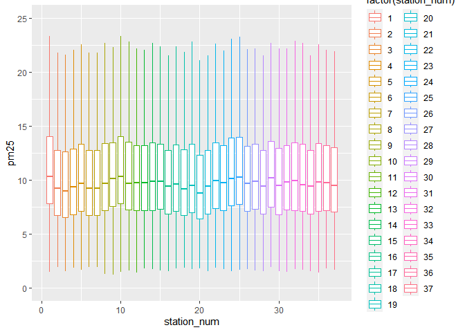

# Twin Cities Station Mapping


## Research Question

Which demographic groups are impacted by light rail openings in the
United States?

## Research Context

We’re focused on the “Twin Cities”, Minneapolis and St. Paul, Minnesota
and the impact of the opening of the METRO Blue and METRO Green lines.

Timeline: 2000-2008

Hypothesis: Light rail openings decrease the pollution around stations

- Reasoning: While light rail openings gather commuters, only two of the
  stations have parking, so on average, the net PM2.5 pollution should
  in theory be lower. In addition, many of these commuters are electing
  to use the light rail instead of their own transportation, further
  contributing to a reduction in PM2.5

- Confounding Factors:

  - Power Plants

  - Recycling Centers

  - Refineries

  - Factories

  - Heating Plants

  - Paper Mills

  - Meteorological Factors

  - Local/Federal/State Policies

``` r
library("knitr")
figure1 <- read.csv("Sources of Pollution - Twin Cities - Sheet1 (2).csv")
kable(figure1)
```

| Factories                                                | Notes                                                                   | Location                                   |
|:---------------------------------------------------------|:------------------------------------------------------------------------|:-------------------------------------------|
| Northern Metal Recycling, Becker, MN                     | Known for past violations related to particulate emissions.             | North Minneapolis                          |
| Flint Hills Resources Line Bend Refinery, Rosemount, MN  | Major source of industrial emissions, including various air pollutants. | Rosemount                                  |
| Xcel Energy’s Allen S. King Plant, Bayport, MN           | A coal-fired power plant contributing to emissions.                     | St. Croix River                            |
| Gerdau Ameristeel, St Paul, MN                           | A steel production facility scrutinized for particulate emissions.      | St. Paul                                   |
| 3M Cottage Grove                                         | Produces various chemicals, emitting VOCs and other pollutants          | Cottage Grove                              |
| Hennepin Energy Recovery Center (HERC)                   | A waste-to-energy facility known for emissions from burning waste.      | Minneapolis                                |
| Koch Industries (Flint Hills Resources), Minneapolis, MN | Another significant contributor from its refining operations.           | Rosemount                                  |
| Xcel Energy High Bridge Plant, St Paul, MN               | A natural gas-fired power plant contributing to air pollutants.         | St. Paul                                   |
| University of Minnesota Heating Plant, Minneapolis, MN   | Emits pollutants from burning fuel for campus energy needs.             | Minneapolis                                |
| Federal Premium Ammunition, Anoka, MN                    | Ammunition manufacturing contributing to localized air pollution.       | Anoka                                      |
| Certain Teed Corporation, Shakopee, MN                   | Produces building materials, contributing to emissions.                 | Shakopee                                   |
| UPM Blandin Paper Mill, Grand Rapids, MN                 | Paper production conributing to air emissions.                          | Grand Rapids (nearby the Twin Cities area) |

## Green & Blue Line Stations

Below is a list of all 37 stations for the METRO Green and Blue Lines.

``` r
figure2 <- read.csv("Twin Cities Stations - Sheet1.csv")
kable(figure2)
```

| Stations                             | Opening.Dates     | Address                                                                                               | Parking |
|:-------------------------------------|:------------------|:------------------------------------------------------------------------------------------------------|:--------|
| 10th Street                          | June 14, 2014     | Keefe Co. Parking 10th Street Lot 215 E 10th St Downtown St Paul, MN 55101                            | FALSE   |
| 30th Avenue                          | December 4, 2004  | 8100 30th Avenue South Bloomington, Minnesota                                                         | TRUE    |
| 38th Street                          | June 26, 2004     | 2902 38th Street East Minneapolis, Minnesota                                                          | FALSE   |
| 46th Street                          | June 26, 2004     | 3660 46th Street East Minneapolis, Minnesota                                                          | FALSE   |
| 50th Street / Minnehaha Park         | June 26, 2004     | 5010 Minnehaha Avenue Minneapolis, Minnesota                                                          | FALSE   |
| American Boulevard                   | December 12, 2009 | 34th Avenue South & East American Boulevard Bloomington, Minnesota                                    | FALSE   |
| Bloomington Central                  | December 4, 2004  | 8101 31st Avenue South Bloomington, Minnesota                                                         | FALSE   |
| Capitol / Rice Street                | June 14, 2014     | 130 University Avenue West Saint Paul, Minnesota                                                      | FALSE   |
| Cedar-Riverside                      | June 26, 2004     | 613 15th Avenue South Minneapolis, Minnesota                                                          | FALSE   |
| Central                              | June 14, 2014     | 56 Fifth Street East Saint Paul, Minnesota                                                            | FALSE   |
| Dale Street                          | June 14, 2014     | 616 University Avenue West (Eastbound) 641 University Avenue West (Westbound) Saint Paul, Minnesota   | FALSE   |
| East Bank                            | June 14, 2014     | 551 Washington Avenue Minneapolis, Minnesota                                                          | FALSE   |
| Fairview Avenue                      | June 14, 2014     | 1863 University Avenue West Saint Paul, Minnesota                                                     | FALSE   |
| Fort Snelling                        | June 26, 2004     | 6053 Minnehaha Avenue Fort Snelling, Minnesota                                                        | TRUE    |
| Franklin Avenue                      | June 26, 2004     | 1808 Franklin Avenue East Minneapolis, Minnesota                                                      | FALSE   |
| Government Plaza                     | June 24, 2004     | 352 South 5th Street Minneapolis, Minnesota                                                           | FALSE   |
| Hamline Avenue                       | June 14, 2014     | 1324 University Avenue West (Eastbound) 1359 University Avenue West (Westbound) Saint Paul, Minnesota | FALSE   |
| Lake Street / Midtown                | June 26, 2004     | 2310 Lake Street East Minneapolis, Minnesota                                                          | FALSE   |
| Lexington Parkway                    | June 14, 2014     | 1100 University Avenue West (Eastbound) 1117 University Avenue West (Westbound) Saint Paul, Minnesota | FALSE   |
| Mall of America                      | December 4, 2004  | 8240 24th Avenue South Bloomington, Minnesota                                                         | FALSE   |
| Nicollet Mall                        | June 26, 2004     | 35 South 5th Street Minneapolis, Minnesota                                                            | FALSE   |
| Prospect Park                        | June 14, 2014     | 319 29th Avenue Minneapolis, Minnesota                                                                | FALSE   |
| Raymond Avenue                       | June 14, 2014     | 2305 University Avenue West Saint Paul, Minnesota                                                     | FALSE   |
| Robert Street                        | June 14, 2014     | 613 Robert Street North Saint Paul, Minnesota                                                         | FALSE   |
| Saint Paul Union Depot               | June 14, 2014     | 214 Fourth Street East Saint Paul, Minnesota United States                                            | FALSE   |
| Snelling Avenue                      | June 14, 2014     | 1572 University Avenue West (Eastbound) 1595 University Avenue West (Westbound) Saint Paul, Minnesota | FALSE   |
| Stadium Village                      | June 14, 2014     | 2301 University Avenue Minneapolis, Minnesota                                                         | FALSE   |
| Target Field                         | November 14, 2009 | 5th Street & 3rd Avenue North Minneapolis, Minnesota                                                  | FALSE   |
| Terminal 1 - Lindbergh               | December 4, 2004  | 6450 Glumack Drive Fort Snelling, Minnesota                                                           | FALSE   |
| Terminal 2 - Humphrey                | December 4, 2004  | 7115 Humphrey Drive Fort Snelling, Minnesota                                                          | FALSE   |
| U.S. Bank Stadium                    | June 26, 2004     | 429 Park Ave South Minneapolis, Minnesota                                                             | FALSE   |
| VA Medical Center                    | June 26, 2004     | 5504 Minnehaha Avenue Fort Snelling, Minnesota                                                        | FALSE   |
| Victoria Street                      | June 14, 2014     | 844 University Avenue West (Eastbound) 875 University Avenue West (Westbound) Saint Paul, Minnesota   | FALSE   |
| Warehouse District / Hennepin Avenue | June 26, 2004     | 23 North 5th Street Minneapolis, Minnesota                                                            | FALSE   |
| West Bank                            | June 14, 2014     | 275 Cedar Avenue Minneapolis, Minnesota                                                               | FALSE   |
| Western Avenue                       | June 14, 2014     | 358 University Avenue West (Eastbound) 401 University Avenue West (Westbound) Saint Paul, Minnesota   | FALSE   |
| Westgate                             | June 14, 2014     | 2646 University Avenue West (Eastbound) 2671 University Avenue West (Westbound) Saint Paul, Minnesota | FALSE   |

## Station Information

This code reads the data from csv files we created that contains the
names of each station . The METRO Blue and Green lines in total have 37
stations. This file has the name of each station, their addresses,
opening dates, and whether or not they have parking.

``` r
library("tidyverse")
library("ggmap") 

station_data <- read.csv("Twin Cities Stations - Sheet1.csv") %>%
  mutate(Station2=paste(Stations, "Station Metro Transit, Minnesota"))
```

This next segments use a Google API key in order to get the locations of
each station of the light rail in latitude/longitude coordinates, then
fixes a few select points where the Google API failed to get a precise
location.

``` r
register_google(key = "GoogleAPIKey", write = TRUE)

addr.geo <- mutate_geocode(station_data, location = Station2, output = "latlona")
```

``` r
geo <- addr.geo %>%
  mutate(lat2 = ifelse(address=="bloomington, mn, usa", 44.85639, lat)) %>%
  mutate(lon2 = ifelse(address=="bloomington, mn, usa", -93.22628, lon)) %>%
  mutate(lat2 = ifelse(address=="minnesota, usa", 44.95648, lat2)) %>%
  mutate(lon2 = ifelse(address=="minnesota, usa", -93.17874, lon2)) %>%
  mutate(lat2 = ifelse(Station2=="Western Avenue station Metro Transit, Minnesota", 44.95586, lat2)) %>%
  mutate(lon2 = ifelse(Station2=="Western Avenue station Metro Transit, Minnesota", -93.11708, lon2))
```

## Plotting the Stations

This next code segment plots each of the station locations (in
latitude/longitude) we extracted in the previous stage

``` r
library("terra")
geo <- read.csv("stations_with_locations.csv")

sample_coords <- cbind(geo$lon2, geo$lat2)
lr_stations <- vect(sample_coords)
geom(lr_stations)
```

          geom part         x        y hole
     [1,]    1    1 -93.09750 44.95065    0
     [2,]    2    1 -93.23159 44.85585    0
     [3,]    3    1 -93.22945 44.93465    0
     [4,]    4    1 -93.21982 44.92075    0
     [5,]    5    1 -93.21016 44.91243    0
     [6,]    6    1 -93.22326 44.85794    0
     [7,]    7    1 -93.22628 44.85639    0
     [8,]    8    1 -93.10517 44.95575    0
     [9,]    9    1 -93.25105 44.96840    0
    [10,]   10    1 -93.09231 44.94615    0
    [11,]   11    1 -93.12644 44.95572    0
    [12,]   12    1 -93.23106 44.97370    0
    [13,]   13    1 -93.17874 44.95648    0
    [14,]   14    1 -93.19802 44.89337    0
    [15,]   15    1 -93.24699 44.96253    0
    [16,]   16    1 -93.26616 44.97687    0
    [17,]   17    1 -93.15773 44.95572    0
    [18,]   18    1 -93.23882 44.94838    0
    [19,]   19    1 -93.14754 44.95579    0
    [20,]   20    1 -93.24014 44.85512    0
    [21,]   21    1 -93.26993 44.97858    0
    [22,]   22    1 -93.21527 44.97154    0
    [23,]   23    1 -93.19544 44.96309    0
    [24,]   24    1 -93.09751 44.95402    0
    [25,]   25    1 -93.08520 44.94757    0
    [26,]   26    1 -93.16765 44.95572    0
    [27,]   27    1 -93.22276 44.97477    0
    [28,]   28    1 -93.27708 44.98326    0
    [29,]   29    1 -93.20493 44.88073    0
    [30,]   30    1 -93.22407 44.87412    0
    [31,]   31    1 -93.25992 44.97495    0
    [32,]   32    1 -93.20227 44.90281    0
    [33,]   33    1 -93.13558 44.95571    0
    [34,]   34    1 -93.27310 44.98003    0
    [35,]   35    1 -93.24548 44.97206    0
    [36,]   36    1 -93.17874 44.95648    0
    [37,]   37    1 -93.20725 44.96785    0

``` r
crdref <- "+proj=longlat +datum=WGS84"
pts <- vect(sample_coords, crs=crdref)
plot(pts)
```


## Plotting the Stations (Part 2)

This code chunk displays the station locations on top of a real map with
a 500m buffer circle around each station location. These buffers and
their sizes are to help to later extract the average PM2.5 and control
data for each of the stations individually while limiting the influence
of potential other sources of PM2.5 as well as overlap with other
stations.

``` r
library("terra")
library("maptiles")
```

    Warning: package 'maptiles' was built under R version 4.3.3

``` r
geo <- read.csv("stations_with_locations.csv")

pts_buffer <- buffer(pts, width = 500) # Width is measured in meters
plot(pts_buffer)
```


``` r
#writeVector(pts_buffer, "Station_Buffers.shp")

tc_lr <- vect("lr_1km_buff/lr_1km_buff.shp")
tc_lr_line <- aggregate(tc_lr, dissolve = TRUE)
lr_project <- project(tc_lr_line, "+proj=longlat + ellps = WGS84 +datum = WGS84 + nodefs")

lrc <- centroids(lr_project, inside = FALSE)

pts_buffer1 <- buffer(lrc, width = 10000)
extent <- buffer(pts, width = 600)

bg <- get_tiles(ext(extent))
plot(bg)
points(pts)
lines(pts_buffer1, col = "blue")
lines(pts_buffer, col = "red")
```


## Find Sources of Pollution near Light Rail Routes and its Addresses

This file has the name of each factory, their addresses, opening dates,
and whether or not they have parking.

``` r
library("tidyverse")
library("ggmap") 

factory_data <- read.csv("Sources of Pollution - Twin Cities - Sheet1 (2).csv") %>%
  mutate(Factory2=paste(Factories, "Factory, Minnesota"))
```

This next segments use a Google API key in order to get the locations of
each station of the light rail in latitude/longitude coordinates, then
fixes a few select points where the Google API failed to get a precise
location.

``` r
register_google(key = "GoogleAPIKey", write = TRUE)

addr.geo <- mutate_geocode(factory_data, location = Factory2, output = "latlona")
```

``` r
geo2 <- addr.geo %>%
  mutate(lat2 = ifelse(Factories=="Flint Hills Resources Line Bend Refinery, Rosemount, MN", 44.76432, lat)) %>%
  mutate(lon2 = ifelse(Factories=="Flint Hills Resources Line Bend Refinery, Rosemount, MN", -93.03947, lon)) %>%
  mutate(lat2 = ifelse(Factories=="Koch Industries (Flint Hills Resources), Rosemount, MN", 44.76424, lat2)) %>%
  mutate(lon2 = ifelse(Factories=="Koch Industries (Flint Hills Resources), Rosemount, MN", -93.03943, lon2))

write.csv(geo2, "pollution_locations.csv")
```

## Plotting the Factory Sources of Pollution

``` r
library("terra")
geo <- read.csv("stations_with_locations.csv")
geo2 <- read.csv("pollution_locations.csv")

sample_coords <- cbind(geo$lon2, geo$lat2)
lr_stations <- vect(sample_coords)
geom(lr_stations)
```

          geom part         x        y hole
     [1,]    1    1 -93.09750 44.95065    0
     [2,]    2    1 -93.23159 44.85585    0
     [3,]    3    1 -93.22945 44.93465    0
     [4,]    4    1 -93.21982 44.92075    0
     [5,]    5    1 -93.21016 44.91243    0
     [6,]    6    1 -93.22326 44.85794    0
     [7,]    7    1 -93.22628 44.85639    0
     [8,]    8    1 -93.10517 44.95575    0
     [9,]    9    1 -93.25105 44.96840    0
    [10,]   10    1 -93.09231 44.94615    0
    [11,]   11    1 -93.12644 44.95572    0
    [12,]   12    1 -93.23106 44.97370    0
    [13,]   13    1 -93.17874 44.95648    0
    [14,]   14    1 -93.19802 44.89337    0
    [15,]   15    1 -93.24699 44.96253    0
    [16,]   16    1 -93.26616 44.97687    0
    [17,]   17    1 -93.15773 44.95572    0
    [18,]   18    1 -93.23882 44.94838    0
    [19,]   19    1 -93.14754 44.95579    0
    [20,]   20    1 -93.24014 44.85512    0
    [21,]   21    1 -93.26993 44.97858    0
    [22,]   22    1 -93.21527 44.97154    0
    [23,]   23    1 -93.19544 44.96309    0
    [24,]   24    1 -93.09751 44.95402    0
    [25,]   25    1 -93.08520 44.94757    0
    [26,]   26    1 -93.16765 44.95572    0
    [27,]   27    1 -93.22276 44.97477    0
    [28,]   28    1 -93.27708 44.98326    0
    [29,]   29    1 -93.20493 44.88073    0
    [30,]   30    1 -93.22407 44.87412    0
    [31,]   31    1 -93.25992 44.97495    0
    [32,]   32    1 -93.20227 44.90281    0
    [33,]   33    1 -93.13558 44.95571    0
    [34,]   34    1 -93.27310 44.98003    0
    [35,]   35    1 -93.24548 44.97206    0
    [36,]   36    1 -93.17874 44.95648    0
    [37,]   37    1 -93.20725 44.96785    0

``` r
crdref <- "+proj=longlat +datum=WGS84"
pts <- vect(sample_coords, crs=crdref)

pol_coords <- cbind(geo2$lon2, geo2$lat2)
crdref <- "+proj=longlat +datum=WGS84"
pol_pts <- vect(pol_coords, crs=crdref)

library("maptiles")

plot(pts)
```


``` r
pts_buffer <- buffer(pts, width = 500) # Width is measured in meters
plot(pts_buffer)
```


``` r
lrc <- centroids(lr_project, inside = FALSE)

pts_buffer1 <- buffer(lrc, width = 10000)
extent <- buffer(pts, width = 600)

bg <- get_tiles(ext(extent))
plot(bg)
points(pts)
points(pol_pts, col = "purple", cex = 1.5)
lines(pts_buffer1, col = "blue")
lines(pts_buffer, col = "red")
```


## Plotting Meteorology Data

``` r
library("terra")
library("tidyverse")

#makes of list of files in that folder
files<-dir("G:/Shared drives/2024 FIRE Light Rail/DATA/GLDAS/")

for(i in 1:3288){
  r<-rast(paste0("G:/Shared drives/2024 FIRE Light Rail/DATA/GLDAS/", files[i]))

  names(r)
  #variables in page 19 of manual
  #https://hydro1.gesdisc.eosdis.nasa.gov/data/GLDAS/GLDAS_CLSM025_D.2.0/doc       /README_GLDAS2.pdf
  #Snowf_tavg<-r[[6]]
  #plot(Snowf_tavg)

  station_buffers<-vect("Station_Buffers.shp")

  #crops raster to contain only buffers around stations
  int<-crop(r, station_buffers,
            snap="in",
            mask=TRUE)
  plot(int)

  #convert cropped raster into dataframe and find average value
  metdf<-terra::extract(int, sta, fun="mean", na.rm=TRUE)  %>% 
    summarise(across(where(is.numeric), ~ mean(.x, na.rm = TRUE))) %>%
    select(-ID)

  metdf$date<-files[i]
  
  write.csv(metdf, paste0("TC_Meteorology_Data/", files[i],".csv"), row.names = F)

}
```

## Combining the data

This code combines all of the previous data we’ve gathered into a single
dataframe, along with adding in some additional variables. This
dataframe includes each station name, each station id, the date, PM2.5,
meteorological variables, the month, day of the week, and whether or not
the day is a holiday.

``` r
library("dplyr")
library("data.table")
path<-"C:/Users/rygel/Documents/team-twin-cities/TC_Meteorology_Data/"
days<-dir(path) #makes a vector of folder names

setwd("C:/Users/rygel/Documents/team-twin-cities/TC_Meteorology_Data/")

combined_files <- bind_rows(lapply(days, fread))

setwd("C:/Users/rygel/Documents/team-twin-cities/")

write.csv(combined_files, "Full_Meteorology_Data.csv")

stations <- read.csv("Station Names and IDs.csv")

path<-"C:/Users/rygel/Documents/team-twin-cities/Twin_Cities_PM25/"
months<-dir(path) #makes a vector of folder names

setwd("C:/Users/rygel/Documents/team-twin-cities/Twin_Cities_PM25/")


combined_files <- bind_rows(lapply(months, fread))

write.csv(combined_files, "Full_PM25_Data.csv", row.names = F)

setwd("C:/Users/rygel/Documents/team-twin-cities/")

PM25 <- read.csv("Full_PM25_Data.csv")
Holidays <- read.csv("major_holidays_2000_2025.csv")
Holidays = subset(Holidays, select = -year)
Weather <- read.csv("Full_Meteorology_Data.csv")
Weather = subset(Weather, select = -X)
Weather = subset(Weather, select = -V1)
stations = read.csv("Station Names and IDs.csv")

weather_fixed_date <- Weather %>%
  mutate(date = stringr::str_extract(date, "[0-9]{4}[0-9]{2}[0-9]{2}")) %>%
  mutate(date = paste(substr(date, 1, 4), "-", substr(date, 5, 6), "-", substr(date, 7, nchar(date)), sep = ""))

pm25_fixed_date <- PM25 %>%
  mutate(date = stringr::str_extract(date, "[0-9]{4}[0-9]{2}[0-9]{2}")) %>%
  mutate(date = paste(substr(date, 1, 4), "-", substr(date, 5, 6), "-", substr(date, 7, nchar(date)), sep = ""))

pm25_stations = merge(pm25_fixed_date, stations, by = "station_num")

add_weather = merge(pm25_stations, weather_fixed_date, by = "date", all.x = TRUE, all.y = FALSE)

add_holidays = merge(add_weather, Holidays, by = "date", all.x = TRUE, all.y = FALSE)

full_fixed_cols <- add_holidays %>%
  mutate(holiday = ifelse(is.na(holiday), FALSE, TRUE)) %>%
  mutate(day_of_week = weekdays(as.Date(date))) %>%
  mutate(month = months(as.Date(date)))

date_stations_sorted <- full_fixed_cols[order(full_fixed_cols$date, full_fixed_cols$station_num),]

write.csv(date_stations_sorted, "Mega_Dataframe.csv", row.names = F)
```

## Plotting PM2.5 of the different stations over time

This code plots a boxplot for the PM2.5 on each date from 2000-2008 for
each station as well as finds the differences in average PM2.5 before
and after the opening of the METRO Blue Line on June 14th, 2004. Using
this data as well as factoring in parking and other pollution sources,
we have decided to remove stations 1, 16, 28, and 34 from our data.

``` r
library(ggplot2)

all_data = read.csv("Mega_Dataframe.csv")
half_data = head(all_data, 120398)
truncated_data = head(all_data, 60199)
truncated_data2 = head(tail(all_data, -60199), 60199)

ggplot(data = half_data, aes(x = station_num, y = pm25)) +
  geom_boxplot(outlier.shape = NA, aes(group = station_num, color = factor(station_num))) +
  ylim(0, 25)
```


``` r
ggplot(data = truncated_data, aes(x = station_num, y = pm25)) +
  geom_boxplot(outlier.shape = NA, aes(group = station_num, color = factor(station_num))) +
  ylim(0, 25)
```


``` r
ggplot(data = truncated_data2, aes(x = station_num, y = pm25)) +
  geom_boxplot(outlier.shape = NA, aes(group = station_num, color = factor(station_num))) +
  ylim(0, 25)
```



``` r
before_mean<- aggregate(x=truncated_data$pm25,
                      # Specify group indicator
                      by = list(truncated_data$station_num),      
                      # Specify function (i.e. mean)
                      FUN = mean)
print(before_mean)
```

       Group.1        x
    1        1 12.09726
    2        2 10.79461
    3        3 10.91249
    4        4 10.89401
    5        5 10.87087
    6        6 10.79461
    7        7 10.79461
    8        8 11.33500
    9        9 11.54214
    10      10 12.09726
    11      11 11.61614
    12      12 11.43106
    13      13 11.36858
    14      14 10.91020
    15      15 11.49296
    16      16 10.38051
    17      17 11.31915
    18      18 11.13391
    19      19 11.42066
    20      20 10.60747
    21      21 10.38051
    22      22 11.52329
    23      23 11.29416
    24      24 12.03742
    25      25 12.02272
    26      26 11.27738
    27      27 11.44644
    28      28 10.38051
    29      29 11.11829
    30      30 10.82124
    31      31 11.17027
    32      32 10.87614
    33      33 11.43159
    34      34 10.38051
    35      35 11.50746
    36      36 11.36858
    37      37 11.04237

``` r
after_mean<- aggregate(x=truncated_data2$pm25,
                      # Specify group indicator
                      by = list(truncated_data2$station_num),      
                      # Specify function (i.e. mean)
                      FUN = mean)
print(after_mean)
```

       Group.1        x
    1        1 11.64811
    2        2 10.40152
    3        3 10.22335
    4        4 10.50410
    5        5 10.84584
    6        6 10.40152
    7        7 10.40152
    8        8 10.89597
    9        9 11.18554
    10      10 11.64811
    11      11 11.02539
    12      12 10.89726
    13      13 10.88296
    14      14 10.99503
    15      15 10.98797
    16      16 10.49803
    17      17 10.84544
    18      18 10.42011
    19      19 10.78668
    20      20 10.03148
    21      21 10.49803
    22      22 11.05676
    23      23 10.82675
    24      24 11.44612
    25      25 11.53627
    26      26 10.82075
    27      27 10.97957
    28      28 10.49803
    29      29 11.25919
    30      30 10.56495
    31      31 10.86789
    32      32 11.00663
    33      33 10.84038
    34      34 10.49803
    35      35 10.94402
    36      36 10.88296
    37      37 10.62504

``` r
b = before_mean$x
a = after_mean$x
print(a-b)
```

     [1] -0.44914271 -0.39309537 -0.68913994 -0.38990957 -0.02502317 -0.39309537
     [7] -0.39309537 -0.43902811 -0.35660272 -0.44914271 -0.59074737 -0.53380133
    [13] -0.48561347  0.08482476 -0.50498776  0.11752862 -0.47370918 -0.71379870
    [19] -0.63398636 -0.57599092  0.11752862 -0.46652529 -0.46741556 -0.59129455
    [25] -0.48644745 -0.45662643 -0.46687029  0.11752862  0.14090148 -0.25628933
    [31] -0.30237809  0.13049445 -0.59121732  0.11752862 -0.56344091 -0.48561347
    [37] -0.41732675

## Setting Relevant Dates

The following code sets a list of dates for the relevant start and end
dates for the period of interest (June 2000 - June 2008), the opening of
the Metro Blue Line, the date when construction on the Blue Line began,
and a list of dates when relevant policies that might impact the level
of PM2.5 were enacted.

``` r
library("tidyverse")
```

``` r
df <- read.csv("Mega_Dataframe.csv")
```

``` r
df2 <- df %>%
  mutate(date = as.Date(date, format = '%Y-%m-%d'))
```

``` r
# Period of Analysis
startdate <- as.Date("2000-06-01", format = '%Y-%m-%d')
enddate <- as.Date("2008-06-01", format = '%Y-%m-%d')
opendate <- as.Date("2004-06-14", format = "%Y-%m-%d")
conststart <- as.Date("2001-01-17", format = "%Y-%m-%d")
#Heavy-Duty Engine and Vehicle Standards
HD_Engine <- as.Date("2007-01-01", format = "%Y-%m-%d")
#Nonroad Diesel Rule
NR_Diesel <- as.Date("2004-06-29", format = "%Y-%m-%d")
#Minnesota Mercury Reduction Act
MC_Reduction <- as.Date("2006-05-11", format = "%Y-%m-%d")
#Next Gen Energy Act
NG_Energy <- as.Date("2007-05-25", format = "%Y-%m-%d")
#2030 Regional Development Framework
RDF <- as.Date("2004-01-01", format = "%Y-%m-%d")
#Clean Air Minnesota Initiative
CA_Init <- as.Date("2003-01-01", format = "%Y-%m-%d")
#Minnesota Renewable Energy Standard
RE_Standard <- as.Date("2001-01-01", format = "%Y-%m-%d")
#Vehicle Emissions Inspection and Maintenance Programs
VE_Programs <- as.Date("2001-04-05", format = "%Y-%m-%d")
```

## Adding DB-OLS Variables

The following code limits the data to the aforementioned period of
interest and adds dummy variable columns for the day of the week fixed
effects, the opening date of the metro, the start of construction date,
the temperature, humidity, and wind speed and their lag polynomials, the
time in days and its polynomials, and finally a column for each of the
relevant policies from the previous section. The time and weather
polynomials are to replicate the methodology of (Chen, 2012).

``` r
df3 <- df2 %>%
  filter(date>=startdate & date <= enddate) %>%
  mutate(MetroOpen = ifelse(date >= opendate, 1, 0)) %>%
  mutate(dow = wday(date)) %>%
  mutate(construction = ifelse(date > conststart & date < opendate, 1, 0)) %>%
  group_by(station_num) %>%
  arrange(station_num, date) %>%
  mutate(t = as.numeric(date-startdate)) %>%
  mutate(t2 = t^2, t3 = t^3, t4 = t^4) %>%
  mutate(l_tair = lag(Tair_f_tavg)) %>%
  mutate(l_tair_2 = l_tair^2) %>%
  mutate(l_tair_3 = l_tair^3) %>%
  mutate(l_tair_4 = l_tair^4) %>%
  mutate(l_qair = lag(Qair_f_tavg)) %>%
  mutate(l_qair_2 = l_qair^2) %>%
  mutate(l_qair_3 = l_qair^3) %>%
  mutate(l_qair_4 = l_qair^4) %>%
  mutate(l_wind = lag(Wind_f_tavg)) %>%
  mutate(l_wind_2 = l_wind^2) %>%
  mutate(l_wind_3 = l_wind^3) %>%
  mutate(l_wind_4 = l_wind^4) %>%
  mutate(CA_Init = ifelse(date >= CA_Init, 1, 0)) %>%
  mutate(HD_Engine = ifelse(date >= HD_Engine, 1, 0)) %>%
  mutate(MC_Reduction = ifelse(date >= MC_Reduction, 1, 0)) %>%
  mutate(NG_Energy = ifelse(date >= NG_Energy, 1, 0)) %>%
  mutate(NR_Diesel = ifelse(date >= NR_Diesel, 1, 0)) %>%
  mutate(RDF = ifelse(date >= RDF, 1, 0)) %>%
  mutate(RE_Standard = ifelse(date >= RE_Standard, 1, 0)) %>%
  mutate(VE_Programs = ifelse(date >= VE_Programs, 1, 0))
```

## Running Regression Models

The following code blocks run various regression models including
different control factors each time. The results from these regressions
have been collected into the table below:

| X                        | log.PM2.5.   | X.1   | X.2           | X.3           | X.4           | X.5           | X.6           |
|:-------------------------|:-------------|:------|:--------------|:--------------|:--------------|:--------------|:--------------|
| MetroOpen                | 0.020 \*\*\* | 0.009 | -0.074 \*\*\* | -0.074 \*\*\* | -0.183 \*\*\* | -0.239 \*\*\* | -0.232 \*\*\* |
| Regulation Dummies       |              |       |               |               |               | x             | x             |
| Weather Polynomials      |              |       | x             | x             | x             | x             | x             |
| Construction Dummy       |              | x     | x             | x             | x             | x             | x             |
| Month FE                 |              | x     | x             | x             | x             | x             | x             |
| Day of Week FE           |              | x     | x             | x             | x             | x             | x             |
| Holiday Dummy            |              |       |               | x             | x             | x             | x             |
| t, t^2, t^3, t^4         |              |       |               |               | x             | x             | x             |
| Exclude outlier stations |              |       |               |               |               |               | x             |

This code block runs a simple regression without any of the control
factors.

``` r
summary(m1 <- lm(log(pm25) ~ MetroOpen, data = df3))
```


    Call:
    lm(formula = log(pm25) ~ MetroOpen, data = df3)

    Residuals:
        Min      1Q  Median      3Q     Max 
    -2.2133 -0.3316  0.0022  0.3483  2.0399 

    Coefficients:
                Estimate Std. Error  t value Pr(>|t|)    
    (Intercept) 2.258209   0.002179 1036.542  < 2e-16 ***
    MetroOpen   0.020155   0.003094    6.514 7.37e-11 ***
    ---
    Signif. codes:  0 '***' 0.001 '**' 0.01 '*' 0.05 '.' 0.1 ' ' 1

    Residual standard error: 0.5088 on 108149 degrees of freedom
    Multiple R-squared:  0.0003922, Adjusted R-squared:  0.0003829 
    F-statistic: 42.43 on 1 and 108149 DF,  p-value: 7.366e-11

This code block runs a regression with the construction, month fixed
effects, and day fixed effects added.

``` r
summary(m1 <- lm(log(pm25) ~ MetroOpen +
                   construction +
                   as.factor(month) +
                   as.factor(dow)
                   , data = df3))
```


    Call:
    lm(formula = log(pm25) ~ MetroOpen + construction + as.factor(month) + 
        as.factor(dow), data = df3)

    Residuals:
         Min       1Q   Median       3Q      Max 
    -2.23791 -0.32257  0.00571  0.34266  2.01212 

    Coefficients:
                               Estimate Std. Error t value Pr(>|t|)    
    (Intercept)                2.126934   0.008549 248.801  < 2e-16 ***
    MetroOpen                  0.008517   0.005849   1.456  0.14532    
    construction              -0.012932   0.005950  -2.173  0.02976 *  
    as.factor(month)August     0.146366   0.007373  19.852  < 2e-16 ***
    as.factor(month)December   0.259171   0.007373  35.154  < 2e-16 ***
    as.factor(month)February   0.300376   0.007508  40.006  < 2e-16 ***
    as.factor(month)January    0.223802   0.007346  30.465  < 2e-16 ***
    as.factor(month)July       0.183425   0.007372  24.880  < 2e-16 ***
    as.factor(month)June       0.069034   0.007421   9.302  < 2e-16 ***
    as.factor(month)March      0.211364   0.007335  28.816  < 2e-16 ***
    as.factor(month)May       -0.079168   0.007335 -10.793  < 2e-16 ***
    as.factor(month)November   0.126978   0.007432  17.085  < 2e-16 ***
    as.factor(month)October   -0.060502   0.007372  -8.207 2.30e-16 ***
    as.factor(month)September -0.043941   0.007432  -5.912 3.38e-09 ***
    as.factor(dow)2            0.038167   0.005607   6.807 9.99e-12 ***
    as.factor(dow)3            0.041820   0.005607   7.458 8.82e-14 ***
    as.factor(dow)4            0.042120   0.005607   7.512 5.88e-14 ***
    as.factor(dow)5            0.017742   0.005604   3.166  0.00155 ** 
    as.factor(dow)6            0.028617   0.005603   5.107 3.28e-07 ***
    as.factor(dow)7            0.053976   0.005603   9.633  < 2e-16 ***
    ---
    Signif. codes:  0 '***' 0.001 '**' 0.01 '*' 0.05 '.' 0.1 ' ' 1

    Residual standard error: 0.4927 on 108131 degrees of freedom
    Multiple R-squared:  0.06262,   Adjusted R-squared:  0.06246 
    F-statistic: 380.2 on 19 and 108131 DF,  p-value: < 2.2e-16

This regression adds the weather polynomials to the previous one.

``` r
summary(m1 <- lm(log(pm25) ~ MetroOpen +
                   construction +
                   Tair_f_tavg +
                   l_tair +
                   l_tair_2 +
                   l_tair_3 +
                   l_tair_4 +
                   Qair_f_tavg +
                   l_qair +
                   l_qair_2 +
                   l_qair_3 +
                   l_qair_4 +
                   Wind_f_tavg +
                   l_wind +
                   l_wind_2 +
                   l_wind_3 +
                   l_wind_4 +
                   as.factor(month) +
                   as.factor(dow)
                   , data = df3))
```


    Call:
    lm(formula = log(pm25) ~ MetroOpen + construction + Tair_f_tavg + 
        l_tair + l_tair_2 + l_tair_3 + l_tair_4 + Qair_f_tavg + l_qair + 
        l_qair_2 + l_qair_3 + l_qair_4 + Wind_f_tavg + l_wind + l_wind_2 + 
        l_wind_3 + l_wind_4 + as.factor(month) + as.factor(dow), 
        data = df3)

    Residuals:
         Min       1Q   Median       3Q      Max 
    -2.08008 -0.29745  0.00125  0.31862  1.70920 

    Coefficients:
                                Estimate Std. Error t value Pr(>|t|)    
    (Intercept)               -3.725e+03  5.762e+02  -6.465 1.01e-10 ***
    MetroOpen                 -7.418e-02  5.643e-03 -13.146  < 2e-16 ***
    construction              -8.667e-02  5.740e-03 -15.101  < 2e-16 ***
    Tair_f_tavg                7.317e-03  5.657e-04  12.936  < 2e-16 ***
    l_tair                     5.229e+01  8.351e+00   6.261 3.83e-10 ***
    l_tair_2                  -2.733e-01  4.532e-02  -6.031 1.63e-09 ***
    l_tair_3                   6.305e-04  1.091e-04   5.778 7.60e-09 ***
    l_tair_4                  -5.416e-07  9.842e-08  -5.502 3.75e-08 ***
    Qair_f_tavg                5.148e+01  1.220e+00  42.203  < 2e-16 ***
    l_qair                     3.940e+02  2.167e+01  18.186  < 2e-16 ***
    l_qair_2                  -5.726e+04  3.040e+03 -18.837  < 2e-16 ***
    l_qair_3                   3.420e+06  1.776e+05  19.254  < 2e-16 ***
    l_qair_4                  -7.227e+07  3.654e+06 -19.776  < 2e-16 ***
    Wind_f_tavg               -9.694e-02  1.572e-03 -61.658  < 2e-16 ***
    l_wind                     7.686e-02  6.984e-02   1.100   0.2711    
    l_wind_2                  -4.789e-02  2.627e-02  -1.823   0.0683 .  
    l_wind_3                   6.764e-03  4.147e-03   1.631   0.1028    
    l_wind_4                  -3.244e-04  2.320e-04  -1.398   0.1621    
    as.factor(month)August    -4.942e-01  1.037e-02 -47.654  < 2e-16 ***
    as.factor(month)December   3.813e-01  9.089e-03  41.950  < 2e-16 ***
    as.factor(month)February   4.370e-01  9.630e-03  45.382  < 2e-16 ***
    as.factor(month)January    3.630e-01  9.586e-03  37.871  < 2e-16 ***
    as.factor(month)July      -6.402e-01  1.126e-02 -56.844  < 2e-16 ***
    as.factor(month)June      -5.298e-01  1.014e-02 -52.228  < 2e-16 ***
    as.factor(month)March      2.809e-01  8.054e-03  34.876  < 2e-16 ***
    as.factor(month)May       -2.495e-01  7.590e-03 -32.864  < 2e-16 ***
    as.factor(month)November   2.244e-01  7.618e-03  29.451  < 2e-16 ***
    as.factor(month)October   -7.126e-02  7.366e-03  -9.674  < 2e-16 ***
    as.factor(month)September -3.377e-01  8.756e-03 -38.566  < 2e-16 ***
    as.factor(dow)2            2.195e-02  5.255e-03   4.177 2.95e-05 ***
    as.factor(dow)3            2.109e-02  5.257e-03   4.011 6.04e-05 ***
    as.factor(dow)4            2.825e-02  5.257e-03   5.373 7.77e-08 ***
    as.factor(dow)5            8.879e-03  5.253e-03   1.690   0.0910 .  
    as.factor(dow)6            3.127e-02  5.257e-03   5.948 2.73e-09 ***
    as.factor(dow)7            5.736e-02  5.252e-03  10.920  < 2e-16 ***
    ---
    Signif. codes:  0 '***' 0.001 '**' 0.01 '*' 0.05 '.' 0.1 ' ' 1

    Residual standard error: 0.4608 on 108079 degrees of freedom
      (37 observations deleted due to missingness)
    Multiple R-squared:  0.1802,    Adjusted R-squared:   0.18 
    F-statistic:   699 on 34 and 108079 DF,  p-value: < 2.2e-16

This block adds the holiday control variable into the regression.

``` r
summary(m1 <- lm(log(pm25) ~ MetroOpen +
                   construction +
                   Tair_f_tavg +
                   l_tair +
                   l_tair_2 +
                   l_tair_3 +
                   l_tair_4 +
                   Qair_f_tavg +
                   l_qair +
                   l_qair_2 +
                   l_qair_3 +
                   l_qair_4 +
                   Wind_f_tavg +
                   l_wind +
                   l_wind_2 +
                   l_wind_3 +
                   l_wind_4 +
                   holiday +
                   as.factor(month) +
                   as.factor(dow)
                   , data = df3))
```


    Call:
    lm(formula = log(pm25) ~ MetroOpen + construction + Tair_f_tavg + 
        l_tair + l_tair_2 + l_tair_3 + l_tair_4 + Qair_f_tavg + l_qair + 
        l_qair_2 + l_qair_3 + l_qair_4 + Wind_f_tavg + l_wind + l_wind_2 + 
        l_wind_3 + l_wind_4 + holiday + as.factor(month) + as.factor(dow), 
        data = df3)

    Residuals:
         Min       1Q   Median       3Q      Max 
    -2.08121 -0.29714  0.00104  0.31919  1.70875 

    Coefficients:
                                Estimate Std. Error t value Pr(>|t|)    
    (Intercept)               -3.716e+03  5.762e+02  -6.450 1.13e-10 ***
    MetroOpen                 -7.414e-02  5.643e-03 -13.138  < 2e-16 ***
    construction              -8.668e-02  5.739e-03 -15.102  < 2e-16 ***
    Tair_f_tavg                7.269e-03  5.659e-04  12.844  < 2e-16 ***
    l_tair                     5.215e+01  8.351e+00   6.245 4.25e-10 ***
    l_tair_2                  -2.726e-01  4.532e-02  -6.015 1.81e-09 ***
    l_tair_3                   6.286e-04  1.091e-04   5.760 8.43e-09 ***
    l_tair_4                  -5.398e-07  9.842e-08  -5.484 4.16e-08 ***
    Qair_f_tavg                5.152e+01  1.220e+00  42.234  < 2e-16 ***
    l_qair                     3.938e+02  2.167e+01  18.178  < 2e-16 ***
    l_qair_2                  -5.719e+04  3.040e+03 -18.813  < 2e-16 ***
    l_qair_3                   3.415e+06  1.776e+05  19.222  < 2e-16 ***
    l_qair_4                  -7.214e+07  3.655e+06 -19.740  < 2e-16 ***
    Wind_f_tavg               -9.683e-02  1.573e-03 -61.574  < 2e-16 ***
    l_wind                     8.176e-02  6.986e-02   1.170 0.241861    
    l_wind_2                  -4.995e-02  2.628e-02  -1.901 0.057338 .  
    l_wind_3                   7.110e-03  4.148e-03   1.714 0.086550 .  
    l_wind_4                  -3.443e-04  2.321e-04  -1.483 0.137946    
    holidayTRUE               -2.192e-02  8.025e-03  -2.731 0.006309 ** 
    as.factor(month)August    -4.938e-01  1.037e-02 -47.617  < 2e-16 ***
    as.factor(month)December   3.821e-01  9.094e-03  42.020  < 2e-16 ***
    as.factor(month)February   4.369e-01  9.630e-03  45.372  < 2e-16 ***
    as.factor(month)January    3.626e-01  9.587e-03  37.826  < 2e-16 ***
    as.factor(month)July      -6.390e-01  1.127e-02 -56.705  < 2e-16 ***
    as.factor(month)June      -5.289e-01  1.015e-02 -52.106  < 2e-16 ***
    as.factor(month)March      2.802e-01  8.058e-03  34.769  < 2e-16 ***
    as.factor(month)May       -2.489e-01  7.593e-03 -32.779  < 2e-16 ***
    as.factor(month)November   2.243e-01  7.618e-03  29.450  < 2e-16 ***
    as.factor(month)October   -7.080e-02  7.368e-03  -9.609  < 2e-16 ***
    as.factor(month)September -3.375e-01  8.756e-03 -38.546  < 2e-16 ***
    as.factor(dow)2            2.076e-02  5.273e-03   3.936 8.27e-05 ***
    as.factor(dow)3            1.997e-02  5.272e-03   3.787 0.000152 ***
    as.factor(dow)4            2.712e-02  5.273e-03   5.144 2.70e-07 ***
    as.factor(dow)5            7.952e-03  5.264e-03   1.511 0.130859    
    as.factor(dow)6            2.975e-02  5.287e-03   5.627 1.84e-08 ***
    as.factor(dow)7            5.589e-02  5.280e-03  10.585  < 2e-16 ***
    ---
    Signif. codes:  0 '***' 0.001 '**' 0.01 '*' 0.05 '.' 0.1 ' ' 1

    Residual standard error: 0.4608 on 108078 degrees of freedom
      (37 observations deleted due to missingness)
    Multiple R-squared:  0.1803,    Adjusted R-squared:   0.18 
    F-statistic: 679.2 on 35 and 108078 DF,  p-value: < 2.2e-16

This block adds the time polynomials into the regression.

``` r
summary(m1 <- lm(log(pm25) ~ MetroOpen +
                   construction +
                   Tair_f_tavg +
                   l_tair +
                   l_tair_2 +
                   l_tair_3 +
                   l_tair_4 +
                   Qair_f_tavg +
                   l_qair +
                   l_qair_2 +
                   l_qair_3 +
                   l_qair_4 +
                   Wind_f_tavg +
                   l_wind +
                   l_wind_2 +
                   l_wind_3 +
                   l_wind_4 +
                   holiday +
                   t +
                   t2 +
                   t3 +
                   t4 +
                   as.factor(month) +
                   as.factor(dow)
                   , data = df3))
```


    Call:
    lm(formula = log(pm25) ~ MetroOpen + construction + Tair_f_tavg + 
        l_tair + l_tair_2 + l_tair_3 + l_tair_4 + Qair_f_tavg + l_qair + 
        l_qair_2 + l_qair_3 + l_qair_4 + Wind_f_tavg + l_wind + l_wind_2 + 
        l_wind_3 + l_wind_4 + holiday + t + t2 + t3 + t4 + as.factor(month) + 
        as.factor(dow), data = df3)

    Residuals:
         Min       1Q   Median       3Q      Max 
    -2.05105 -0.29702  0.00137  0.31793  1.71945 

    Coefficients:
                                Estimate Std. Error t value Pr(>|t|)    
    (Intercept)               -3.082e+03  5.753e+02  -5.358 8.45e-08 ***
    MetroOpen                 -1.832e-01  1.293e-02 -14.173  < 2e-16 ***
    construction              -1.765e-01  1.244e-02 -14.190  < 2e-16 ***
    Tair_f_tavg                8.146e-03  5.644e-04  14.433  < 2e-16 ***
    l_tair                     4.285e+01  8.338e+00   5.139 2.77e-07 ***
    l_tair_2                  -2.215e-01  4.525e-02  -4.895 9.83e-07 ***
    l_tair_3                   5.043e-04  1.090e-04   4.628 3.69e-06 ***
    l_tair_4                  -4.266e-07  9.827e-08  -4.341 1.42e-05 ***
    Qair_f_tavg                5.139e+01  1.216e+00  42.270  < 2e-16 ***
    l_qair                     3.728e+02  2.164e+01  17.232  < 2e-16 ***
    l_qair_2                  -5.320e+04  3.033e+03 -17.539  < 2e-16 ***
    l_qair_3                   3.152e+06  1.772e+05  17.790  < 2e-16 ***
    l_qair_4                  -6.650e+07  3.645e+06 -18.246  < 2e-16 ***
    Wind_f_tavg               -9.715e-02  1.566e-03 -62.034  < 2e-16 ***
    l_wind                     5.594e-02  6.956e-02   0.804 0.421301    
    l_wind_2                  -3.938e-02  2.617e-02  -1.505 0.132331    
    l_wind_3                   5.261e-03  4.130e-03   1.274 0.202716    
    l_wind_4                  -2.305e-04  2.311e-04  -0.997 0.318583    
    holidayTRUE               -2.014e-02  7.989e-03  -2.521 0.011705 *  
    t                          9.674e-05  6.250e-05   1.548 0.121663    
    t2                         1.959e-07  7.350e-08   2.665 0.007694 ** 
    t3                        -2.120e-10  3.341e-11  -6.344 2.24e-10 ***
    t4                         5.006e-14  5.249e-15   9.536  < 2e-16 ***
    as.factor(month)August    -4.981e-01  1.037e-02 -48.029  < 2e-16 ***
    as.factor(month)December   4.102e-01  9.194e-03  44.622  < 2e-16 ***
    as.factor(month)February   4.716e-01  9.653e-03  48.854  < 2e-16 ***
    as.factor(month)January    3.959e-01  9.642e-03  41.058  < 2e-16 ***
    as.factor(month)July      -6.433e-01  1.128e-02 -57.022  < 2e-16 ***
    as.factor(month)June      -5.285e-01  1.014e-02 -52.114  < 2e-16 ***
    as.factor(month)March      2.995e-01  8.046e-03  37.226  < 2e-16 ***
    as.factor(month)May       -2.632e-01  7.573e-03 -34.751  < 2e-16 ***
    as.factor(month)November   2.423e-01  7.672e-03  31.581  < 2e-16 ***
    as.factor(month)October   -6.053e-02  7.386e-03  -8.195 2.54e-16 ***
    as.factor(month)September -3.364e-01  8.758e-03 -38.415  < 2e-16 ***
    as.factor(dow)2            2.120e-02  5.249e-03   4.039 5.38e-05 ***
    as.factor(dow)3            2.000e-02  5.248e-03   3.811 0.000139 ***
    as.factor(dow)4            2.725e-02  5.249e-03   5.192 2.08e-07 ***
    as.factor(dow)5            8.576e-03  5.240e-03   1.637 0.101695    
    as.factor(dow)6            3.025e-02  5.262e-03   5.748 9.07e-09 ***
    as.factor(dow)7            5.619e-02  5.256e-03  10.692  < 2e-16 ***
    ---
    Signif. codes:  0 '***' 0.001 '**' 0.01 '*' 0.05 '.' 0.1 ' ' 1

    Residual standard error: 0.4587 on 108074 degrees of freedom
      (37 observations deleted due to missingness)
    Multiple R-squared:  0.1878,    Adjusted R-squared:  0.1875 
    F-statistic: 640.9 on 39 and 108074 DF,  p-value: < 2.2e-16

This block adds the relevant policies for PM2.5 into the regression.

``` r
summary(m1 <- lm(log(pm25) ~ MetroOpen +
                   construction +
                   Tair_f_tavg +
                   l_tair +
                   l_tair_2 +
                   l_tair_3 +
                   l_tair_4 +
                   Qair_f_tavg +
                   l_qair +
                   l_qair_2 +
                   l_qair_3 +
                   l_qair_4 +
                   Wind_f_tavg +
                   l_wind +
                   l_wind_2 +
                   l_wind_3 +
                   l_wind_4 +
                   holiday +
                   t +
                   t2 +
                   t3 +
                   t4 +
                   CA_Init +
                   HD_Engine +
                   MC_Reduction +
                   NG_Energy +
                   NR_Diesel +
                   RDF +
                   RE_Standard +
                   VE_Programs +
                   as.factor(month) +
                   as.factor(dow)
                   , data = df3))
```


    Call:
    lm(formula = log(pm25) ~ MetroOpen + construction + Tair_f_tavg + 
        l_tair + l_tair_2 + l_tair_3 + l_tair_4 + Qair_f_tavg + l_qair + 
        l_qair_2 + l_qair_3 + l_qair_4 + Wind_f_tavg + l_wind + l_wind_2 + 
        l_wind_3 + l_wind_4 + holiday + t + t2 + t3 + t4 + CA_Init + 
        HD_Engine + MC_Reduction + NG_Energy + NR_Diesel + RDF + 
        RE_Standard + VE_Programs + as.factor(month) + as.factor(dow), 
        data = df3)

    Residuals:
         Min       1Q   Median       3Q      Max 
    -2.02662 -0.29402  0.00115  0.31283  1.71067 

    Coefficients:
                                Estimate Std. Error t value Pr(>|t|)    
    (Intercept)               -2.425e+03  5.770e+02  -4.203 2.64e-05 ***
    MetroOpen                 -2.387e-01  2.978e-02  -8.013 1.13e-15 ***
    construction              -1.127e-01  2.090e-02  -5.391 7.03e-08 ***
    Tair_f_tavg                9.961e-03  5.668e-04  17.575  < 2e-16 ***
    l_tair                     3.321e+01  8.363e+00   3.971 7.15e-05 ***
    l_tair_2                  -1.688e-01  4.538e-02  -3.719 0.000200 ***
    l_tair_3                   3.765e-04  1.093e-04   3.445 0.000572 ***
    l_tair_4                  -3.107e-07  9.858e-08  -3.152 0.001621 ** 
    Qair_f_tavg                4.831e+01  1.220e+00  39.615  < 2e-16 ***
    l_qair                     3.356e+02  2.170e+01  15.463  < 2e-16 ***
    l_qair_2                  -4.743e+04  3.045e+03 -15.577  < 2e-16 ***
    l_qair_3                   2.784e+06  1.779e+05  15.651  < 2e-16 ***
    l_qair_4                  -5.834e+07  3.658e+06 -15.949  < 2e-16 ***
    Wind_f_tavg               -9.673e-02  1.562e-03 -61.935  < 2e-16 ***
    l_wind                     4.341e-02  6.937e-02   0.626 0.531480    
    l_wind_2                  -3.022e-02  2.609e-02  -1.158 0.246687    
    l_wind_3                   3.151e-03  4.117e-03   0.765 0.444087    
    l_wind_4                  -7.882e-05  2.304e-04  -0.342 0.732238    
    holidayTRUE               -1.589e-02  7.954e-03  -1.998 0.045686 *  
    t                          1.311e-03  9.601e-05  13.656  < 2e-16 ***
    t2                        -1.321e-06  1.232e-07 -10.721  < 2e-16 ***
    t3                         4.202e-10  5.665e-11   7.417 1.21e-13 ***
    t4                        -4.026e-14  8.600e-15  -4.681 2.85e-06 ***
    CA_Init                    1.560e-01  1.022e-02  15.265  < 2e-16 ***
    HD_Engine                  1.813e-03  9.187e-03   0.197 0.843553    
    MC_Reduction               9.825e-02  1.016e-02   9.673  < 2e-16 ***
    NG_Energy                  8.157e-02  1.188e-02   6.863 6.76e-12 ***
    NR_Diesel                  2.159e-01  2.113e-02  10.220  < 2e-16 ***
    RDF                        5.458e-02  9.319e-03   5.858 4.71e-09 ***
    RE_Standard               -1.784e-02  2.108e-02  -0.846 0.397416    
    VE_Programs               -2.572e-01  1.270e-02 -20.256  < 2e-16 ***
    as.factor(month)August    -5.094e-01  1.057e-02 -48.185  < 2e-16 ***
    as.factor(month)December   4.276e-01  9.373e-03  45.622  < 2e-16 ***
    as.factor(month)February   4.679e-01  9.627e-03  48.602  < 2e-16 ***
    as.factor(month)January    3.941e-01  9.759e-03  40.386  < 2e-16 ***
    as.factor(month)July      -6.489e-01  1.153e-02 -56.301  < 2e-16 ***
    as.factor(month)June      -5.170e-01  1.068e-02 -48.406  < 2e-16 ***
    as.factor(month)March      2.807e-01  8.044e-03  34.895  < 2e-16 ***
    as.factor(month)May       -2.657e-01  7.614e-03 -34.901  < 2e-16 ***
    as.factor(month)November   2.360e-01  7.868e-03  30.000  < 2e-16 ***
    as.factor(month)October   -7.820e-02  7.655e-03 -10.215  < 2e-16 ***
    as.factor(month)September -3.539e-01  8.996e-03 -39.342  < 2e-16 ***
    as.factor(dow)2            2.250e-02  5.225e-03   4.306 1.67e-05 ***
    as.factor(dow)3            2.068e-02  5.224e-03   3.958 7.57e-05 ***
    as.factor(dow)4            2.744e-02  5.225e-03   5.252 1.51e-07 ***
    as.factor(dow)5            9.100e-03  5.215e-03   1.745 0.081025 .  
    as.factor(dow)6            3.056e-02  5.238e-03   5.834 5.42e-09 ***
    as.factor(dow)7            5.622e-02  5.231e-03  10.747  < 2e-16 ***
    ---
    Signif. codes:  0 '***' 0.001 '**' 0.01 '*' 0.05 '.' 0.1 ' ' 1

    Residual standard error: 0.4565 on 108066 degrees of freedom
      (37 observations deleted due to missingness)
    Multiple R-squared:  0.1955,    Adjusted R-squared:  0.1951 
    F-statistic: 558.7 on 47 and 108066 DF,  p-value: < 2.2e-16

Finally, this block removes the stations which were determined to be
outliers (1, 16, 28, 34) into the regression.

``` r
df4 <- df3 %>%
  filter(station_num != 1 & station_num != 16 & station_num != 28 & station_num != 34)

summary(m1 <- lm(log(pm25) ~ MetroOpen +
                   construction +
                   Tair_f_tavg +
                   l_tair +
                   l_tair_2 +
                   l_tair_3 +
                   l_tair_4 +
                   Qair_f_tavg +
                   l_qair +
                   l_qair_2 +
                   l_qair_3 +
                   l_qair_4 +
                   Wind_f_tavg +
                   l_wind +
                   l_wind_2 +
                   l_wind_3 +
                   l_wind_4 +
                   holiday +
                   t +
                   t2 +
                   t3 +
                   t4 +
                   CA_Init +
                   HD_Engine +
                   MC_Reduction +
                   NG_Energy +
                   NR_Diesel +
                   RDF +
                   RE_Standard +
                   VE_Programs +
                   as.factor(month) +
                   as.factor(dow)
                   , data = df4))
```


    Call:
    lm(formula = log(pm25) ~ MetroOpen + construction + Tair_f_tavg + 
        l_tair + l_tair_2 + l_tair_3 + l_tair_4 + Qair_f_tavg + l_qair + 
        l_qair_2 + l_qair_3 + l_qair_4 + Wind_f_tavg + l_wind + l_wind_2 + 
        l_wind_3 + l_wind_4 + holiday + t + t2 + t3 + t4 + CA_Init + 
        HD_Engine + MC_Reduction + NG_Energy + NR_Diesel + RDF + 
        RE_Standard + VE_Programs + as.factor(month) + as.factor(dow), 
        data = df4)

    Residuals:
         Min       1Q   Median       3Q      Max 
    -2.02740 -0.29298  0.00086  0.31218  1.71537 

    Coefficients:
                                Estimate Std. Error t value Pr(>|t|)    
    (Intercept)               -2.466e+03  6.098e+02  -4.044 5.27e-05 ***
    MetroOpen                 -2.315e-01  3.148e-02  -7.354 1.94e-13 ***
    construction              -1.086e-01  2.209e-02  -4.916 8.85e-07 ***
    Tair_f_tavg                9.918e-03  5.990e-04  16.557  < 2e-16 ***
    l_tair                     3.379e+01  8.838e+00   3.823 0.000132 ***
    l_tair_2                  -1.719e-01  4.796e-02  -3.583 0.000340 ***
    l_tair_3                   3.839e-04  1.155e-04   3.323 0.000890 ***
    l_tair_4                  -3.173e-07  1.042e-07  -3.046 0.002321 ** 
    Qair_f_tavg                4.844e+01  1.289e+00  37.583  < 2e-16 ***
    l_qair                     3.353e+02  2.293e+01  14.621  < 2e-16 ***
    l_qair_2                  -4.751e+04  3.218e+03 -14.766  < 2e-16 ***
    l_qair_3                   2.793e+06  1.880e+05  14.860  < 2e-16 ***
    l_qair_4                  -5.858e+07  3.866e+06 -15.154  < 2e-16 ***
    Wind_f_tavg               -9.618e-02  1.651e-03 -58.272  < 2e-16 ***
    l_wind                     3.753e-02  7.331e-02   0.512 0.608701    
    l_wind_2                  -2.755e-02  2.757e-02  -0.999 0.317751    
    l_wind_3                   2.660e-03  4.351e-03   0.611 0.540961    
    l_wind_4                  -4.825e-05  2.434e-04  -0.198 0.842882    
    holidayTRUE               -1.624e-02  8.406e-03  -1.932 0.053363 .  
    t                          1.368e-03  1.015e-04  13.486  < 2e-16 ***
    t2                        -1.394e-06  1.302e-07 -10.710  < 2e-16 ***
    t3                         4.533e-10  5.987e-11   7.572 3.72e-14 ***
    t4                        -4.540e-14  9.089e-15  -4.995 5.89e-07 ***
    CA_Init                    1.636e-01  1.080e-02  15.149  < 2e-16 ***
    HD_Engine                  6.580e-03  9.709e-03   0.678 0.497930    
    MC_Reduction               9.927e-02  1.073e-02   9.248  < 2e-16 ***
    NG_Energy                  8.411e-02  1.256e-02   6.697 2.15e-11 ***
    NR_Diesel                  2.081e-01  2.233e-02   9.318  < 2e-16 ***
    RDF                        6.256e-02  9.848e-03   6.352 2.13e-10 ***
    RE_Standard               -1.887e-02  2.228e-02  -0.847 0.397026    
    VE_Programs               -2.830e-01  1.342e-02 -21.095  < 2e-16 ***
    as.factor(month)August    -5.071e-01  1.117e-02 -45.389  < 2e-16 ***
    as.factor(month)December   4.274e-01  9.906e-03  43.150  < 2e-16 ***
    as.factor(month)February   4.643e-01  1.017e-02  45.634  < 2e-16 ***
    as.factor(month)January    3.886e-01  1.031e-02  37.682  < 2e-16 ***
    as.factor(month)July      -6.466e-01  1.218e-02 -53.084  < 2e-16 ***
    as.factor(month)June      -5.162e-01  1.129e-02 -45.733  < 2e-16 ***
    as.factor(month)March      2.793e-01  8.501e-03  32.852  < 2e-16 ***
    as.factor(month)May       -2.665e-01  8.047e-03 -33.117  < 2e-16 ***
    as.factor(month)November   2.365e-01  8.315e-03  28.447  < 2e-16 ***
    as.factor(month)October   -7.676e-02  8.090e-03  -9.488  < 2e-16 ***
    as.factor(month)September -3.512e-01  9.507e-03 -36.939  < 2e-16 ***
    as.factor(dow)2            2.272e-02  5.522e-03   4.114 3.89e-05 ***
    as.factor(dow)3            2.089e-02  5.521e-03   3.784 0.000154 ***
    as.factor(dow)4            2.777e-02  5.522e-03   5.030 4.93e-07 ***
    as.factor(dow)5            9.260e-03  5.512e-03   1.680 0.092947 .  
    as.factor(dow)6            3.176e-02  5.536e-03   5.738 9.61e-09 ***
    as.factor(dow)7            5.677e-02  5.528e-03  10.268  < 2e-16 ***
    ---
    Signif. codes:  0 '***' 0.001 '**' 0.01 '*' 0.05 '.' 0.1 ' ' 1

    Residual standard error: 0.4556 on 96378 degrees of freedom
      (33 observations deleted due to missingness)
    Multiple R-squared:  0.1966,    Adjusted R-squared:  0.1963 
    F-statistic:   502 on 47 and 96378 DF,  p-value: < 2.2e-16

## References

Sources of Data

1.  Li, B., H. Beaudoing, and M. Rodell, NASA/GSFC/HSL (2020), GLDAS
    Catchment Land Surface Model L4 daily 0.25 x 0.25 degree GRACE-DA1
    V2.2, Greenbelt, Maryland, USA, Goddard Earth Sciences Data and
    Information Services Center (GES DISC), Accessed: 06/17/2024,
    [10.5067/TXBMLX370XX8](https://doi.org/10.5067/TXBMLX370XX8)

2.  Di, Q., Y. Wei, A. Shtein, C. Hultquist, X. Xing, H. Amini, L.
    Shi, I. Kloog, R. Silvern, J. Kelly, M. B. Sabath, C. Choirat, P.
    Koutrakis, A. Lyapustin, Y. Wang, L. J. Mickley, and J. Schwartz.

    2021. Daily and Annual PM2.5 Concentrations for the Contiguous
          United States, 1-km Grids, v1 (2000 - 2016). Palisades, New
          York: NASA Socioeconomic Data and Applications Center (SEDAC).
          <https://doi.org/10.7927/0rvr-4538>. Accessed 06/17/2024.

3.  Di, Q., H. Amini, L. Shi, I. Kloog, R. Silvern, J. Kelly, M. B.
    Sabath, C. Choirat, P. Koutrakis, A. Lyapustin, Y. Wang, L. J.
    Mickley, and J. Schwartz. 2019. An Ensemble-based Model of PM2.5
    Concentration Across the Contiguous United States with High
    Spatiotemporal Resolution. Environment International 130: 104909.
    <https://doi.org/10.1016/j.envint.2019.104909>.

Sources for Relevant Policies:

1.  Minnesota Public Utilities Commission. (2007). Renewable Energy
    Standard. Retrieved from
    [https://mn.gov/puc/activities/economic-analysis/renewable-environmental-dockets/#:~:text=Renewable%20energy%20goals%20were%20passed,%2C%20the%20state’s%20largest%20utility](https://mn.gov/puc/activities/economic-analysis/renewable-environmental-dockets/#:~:text=Renewable%20energy%20goals%20were%20passed,%2C%20the%20state's%20largest%20utility)

2.  Vehicle Emissions Inspection and Maintenance (I/M): Policy and
    technical guidance \| US EPA. (2024, February 2). US EPA.
    <https://www.epa.gov/state-and-local-transportation/vehicle-emissions-inspection-and-maintenance-im-policy-and-technical>

3.  Final Rule for Control of Air Pollution from New Motor Vehicles:
    Heavy-Duty Engine and Vehicle Standards and Highway Diesel Fuel
    Sulfur Control Requirements \| US EPA. (2024, May 17). US EPA.
    <https://www.epa.gov/regulations-emissions-vehicles-and-engines/final-rule-control-air-pollution-new-motor-vehicles>

4.  Proposed Rule and Correction for control of Air pollution from new
    motor vehicles: In-Use Testing for Heavy-Duty Diesel Engines and
    Vehicles \| US EPA. (2023, July 11). US EPA.
    <https://www.epa.gov/regulations-emissions-vehicles-and-engines/final-rule-control-air-pollution-new-motor-vehicles-heavy>

5.  Final rule for control of emissions of air pollution from nonroad
    diesel engines and fuel \| US EPA. (2024, February 6). US EPA.
    <https://www.epa.gov/regulations-emissions-vehicles-and-engines/final-rule-control-emissions-air-pollution-nonroad#:~:text=Rule%20Summary%20In%202004%2C%20EPA%20finalized%20Tier,nonattainment%20areas%20to%20improve%20their%20air%20quality>.

6.  Reducing mercury releases \| Minnesota Pollution Control Agency.
    (n.d.). Minnesota Pollution Control Agency.
    <https://www.pca.state.mn.us/air-water-land-climate/reducing-mercury-releases>

7.  Clean Cars Minnesota. (n.d.). Conservation MN.
    <https://www.conservationminnesota.org/clean-cars-minnesota>

8.  2030 Regional Development Framework - Metropolitan Council. (n.d.).
    Metropolitan Council.
    <https://metrocouncil.org/Planning/Thrive-2040/2030-Regional-Development-Framework.aspx>

9.  Environmental Initiative. (2024, April 19). Clean Air Minnesota -
    Environmental Initiative.
    <https://environmental-initiative.org/our-work/clean-air-minnesota/>

Sources for Confounding Sources of Pollution:

1.  Minnesota Pollution Control Agency. (n.d.). Northern Metal
    Recycling: Air Quality Permit Violations. Retrieved 2024, from
    <https://www.pca.state.mn.us/news-and-stories/northern-metals-pays-12000-for-violating-air-quality-regulations-at-its-becker-facility#:~:text=state.mn.us-,Northern%20Metals%20pays%20%2412%2C000%20for%20violating%20air%20quality%20regulations%20at,particulate%20matter%20>(PM10%20and%20PM2.

2.  St Anthony, N., & Tribune, S. (2022, February 13). Flint Hills’ Pine
    Bend refinery produces more fuel with less pollution. Star Tribune.
    <https://www.startribune.com/flint-hills-pine-bend-refinery-produces-more-fuel-with-less-pollution/600146396/>

3.  Xcel Energy. (n.d.).
    <https://mn.my.xcelenergy.com/s/about/newsroom/press-release/xcel-energy-takes-major-step-toward-replacing-coal-fired-king-plant-with-clean-e-MCQ6MJVC5VIZCSLMVOCUPTC5KMQM>

4.  AIR EMISSION PERMIT. (2008). In epa.gov (No. 12300055–004).
    Environmental Protection Agency.
    <https://www.epa.gov/system/files/documents/2021-12/gerdauameristeel_12300055-004.pdf>

5.  Minnesota Department of Health. (2004). Public health assessment for
    perfluorochemical contamination at a hazardous waste site in
    Minnesota. In Minnesota Department of Health Report.
    <https://www.health.state.mn.us/communities/environment/hazardous/docs/sites/washington/3mcg0205.pdf>

6.  Hennepin County wrestles with future of Minneapolis waste
    incinerator. (2023, September 21). MPR News.
    <https://www.mprnews.org/story/2023/09/21/hennepin-county-wrestles-with-future-of-minneapolis-waste-incinerator>

7.  APA Citation: KOCH REFINING CO./N-REN CORP. \| Superfund Site
    Profile \| Superfund Site Information \| US EPA. (n.d.).
    <https://cumulis.epa.gov/supercpad/SiteProfiles/index.cfm?fuseaction=second.cleanup&id=0503686>

8.  APA Citation: Hillesheim, D. V. & Xcel Energy. (2023). Revised
    Petition for Alternative Operational Limits for Continuous
    Compliance Demonstration under 40 C.F.R. Part 63, Subpart YYYY. In
    U.S. Environmental Protection Agency \[Report\].
    <https://www.epa.gov/system/files/documents/2023-09/Xcel%20Energy%20High%20Bridge_05-22-2023.pdf>

9.  Rademacher, N. (n.d.). Meet the Main Energy Plant: a hidden world
    reducing University emissions. The Minnesota Daily.
    <https://mndaily.com/257087/news/acenergyplant/>

10. ANOKa \| Federal Ammunition \| Minnesota Pollution Control Agency.
    (n.d.). Minnesota Pollution Control Agency.
    <https://www.pca.state.mn.us/local-sites-and-projects/anoka-federal-ammunition>

11. Sfiecke. (2006, September 8). EPA cites CertainTeed for clean air
    violations. SWNewsMedia.com.
    <https://www.swnewsmedia.com/shakopee_valley_news/news/epa-cites-certainteed-for-clean-air-violations/article_ad8d6f3b-44f5-59ab-8451-c3860538a7a9.html>

12. EJMap. (n.d.).
    <https://ejmap.org/displayfacility-74250.htm?giFacilityid=74250&gsTable=facility>
