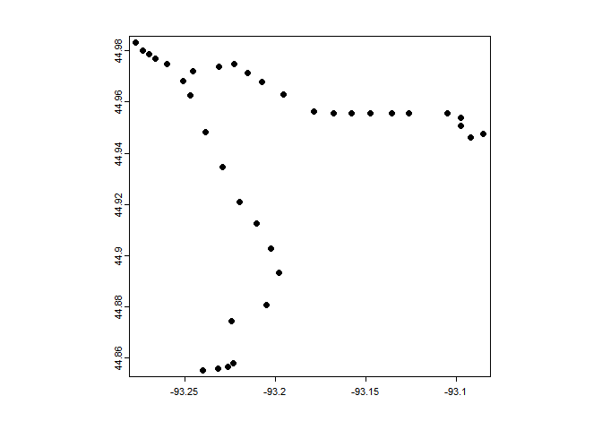
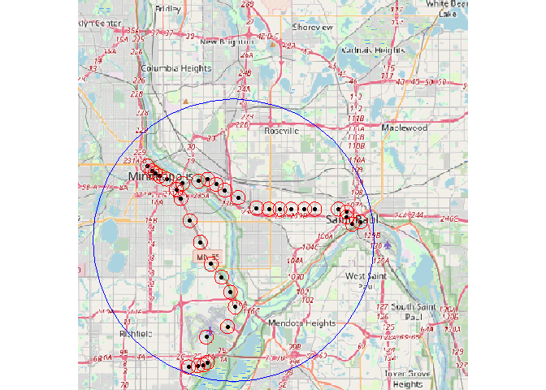
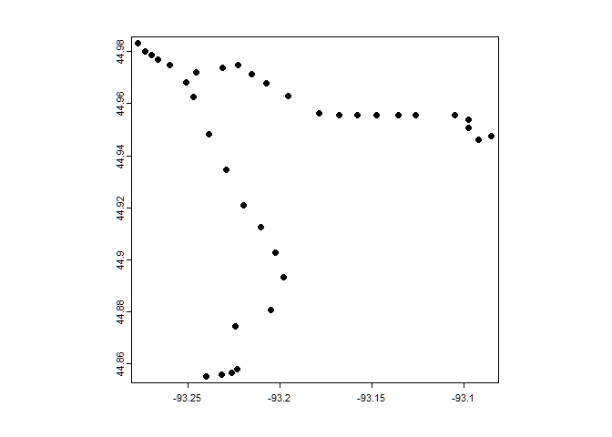
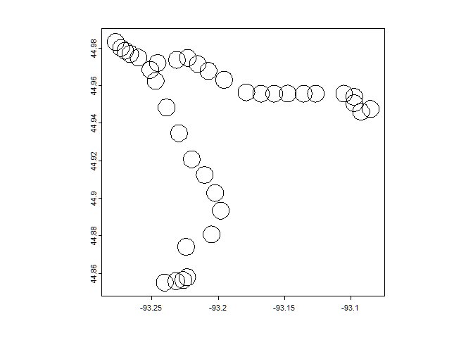
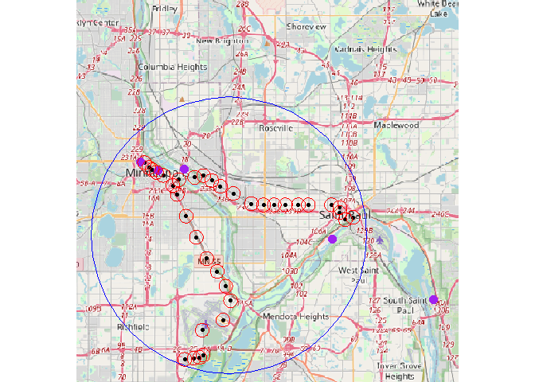
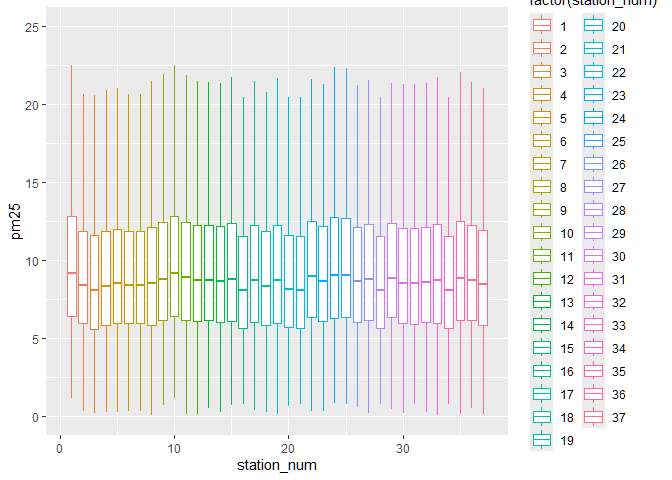

# Twin Cities Station Mapping


## Research Question

Which demographic groups are impacted by light rail openings in the
United States?

## Research Context

We’re focused on the “Twin Cities”, Minneapolis and St. Paul, Minnesota
and the impact of the opening of the METRO Blue and METRO Green lines.

Timeline: 2000-2008

Hypothesis: Light rail openings decrease the pollution around stations

- Reasoning: While light rail openings gather commuters, only two of the
  stations have parking, so on average, the net PM2.5 pollution should
  in theory be lower. In addition, many of these commuters are electing
  to use the light rail instead of their own transportation, further
  contributing to a reduction in PM2.5

- Confounding Factors:

  - Power Plants

  - Recycling Centers

  - Refineries

  - Factories

  - Heating Plants

  - Paper Mills

  - Meteorological Factors

``` r
library("knitr")
figure1 <- read.csv("Sources of Pollution - Twin Cities - Sheet1 (2).csv")
kable(figure1)
```

| Factories                                                | Notes                                                                   | Location                                   |
|:---------------------------------------------------------|:------------------------------------------------------------------------|:-------------------------------------------|
| Northern Metal Recycling, Becker, MN                     | Known for past violations related to particulate emissions.             | North Minneapolis                          |
| Flint Hills Resources Line Bend Refinery, Rosemount, MN  | Major source of industrial emissions, including various air pollutants. | Rosemount                                  |
| Xcel Energy’s Allen S. King Plant, Bayport, MN           | A coal-fired power plant contributing to emissions.                     | St. Croix River                            |
| Gerdau Ameristeel, St Paul, MN                           | A steel production facility scrutinized for particulate emissions.      | St. Paul                                   |
| 3M Cottage Grove                                         | Produces various chemicals, emitting VOCs and other pollutants          | Cottage Grove                              |
| Hennepin Energy Recovery Center (HERC)                   | A waste-to-energy facility known for emissions from burning waste.      | Minneapolis                                |
| Koch Industries (Flint Hills Resources), Minneapolis, MN | Another significant contributor from its refining operations.           | Rosemount                                  |
| Xcel Energy High Bridge Plant, St Paul, MN               | A natural gas-fired power plant contributing to air pollutants.         | St. Paul                                   |
| University of Minnesota Heating Plant, Minneapolis, MN   | Emits pollutants from burning fuel for campus energy needs.             | Minneapolis                                |
| Federal Premium Ammunition, Anoka, MN                    | Ammunition manufacturing contributing to localized air pollution.       | Anoka                                      |
| Certain Teed Corporation, Shakopee, MN                   | Produces building materials, contributing to emissions.                 | Shakopee                                   |
| UPM Blandin Paper Mill, Grand Rapids, MN                 | Paper production conributing to air emissions.                          | Grand Rapids (nearby the Twin Cities area) |

## Green & Blue Line Stations

Below is a list of all 37 stations for the METRO Green and Blue Lines.

``` r
figure2 <- read.csv("Twin Cities Stations - Sheet1.csv")
kable(figure2)
```

| Stations                             | Opening.Dates     | Address                                                                                               | Parking |
|:-------------------------------------|:------------------|:------------------------------------------------------------------------------------------------------|:--------|
| 10th Street                          | June 14, 2014     | Keefe Co. Parking 10th Street Lot 215 E 10th St Downtown St Paul, MN 55101                            | FALSE   |
| 30th Avenue                          | December 4, 2004  | 8100 30th Avenue South Bloomington, Minnesota                                                         | TRUE    |
| 38th Street                          | June 26, 2004     | 2902 38th Street East Minneapolis, Minnesota                                                          | FALSE   |
| 46th Street                          | June 26, 2004     | 3660 46th Street East Minneapolis, Minnesota                                                          | FALSE   |
| 50th Street / Minnehaha Park         | June 26, 2004     | 5010 Minnehaha Avenue Minneapolis, Minnesota                                                          | FALSE   |
| American Boulevard                   | December 12, 2009 | 34th Avenue South & East American Boulevard Bloomington, Minnesota                                    | FALSE   |
| Bloomington Central                  | December 4, 2004  | 8101 31st Avenue South Bloomington, Minnesota                                                         | FALSE   |
| Capitol / Rice Street                | June 14, 2014     | 130 University Avenue West Saint Paul, Minnesota                                                      | FALSE   |
| Cedar-Riverside                      | June 26, 2004     | 613 15th Avenue South Minneapolis, Minnesota                                                          | FALSE   |
| Central                              | June 14, 2014     | 56 Fifth Street East Saint Paul, Minnesota                                                            | FALSE   |
| Dale Street                          | June 14, 2014     | 616 University Avenue West (Eastbound) 641 University Avenue West (Westbound) Saint Paul, Minnesota   | FALSE   |
| East Bank                            | June 14, 2014     | 551 Washington Avenue Minneapolis, Minnesota                                                          | FALSE   |
| Fairview Avenue                      | June 14, 2014     | 1863 University Avenue West Saint Paul, Minnesota                                                     | FALSE   |
| Fort Snelling                        | June 26, 2004     | 6053 Minnehaha Avenue Fort Snelling, Minnesota                                                        | TRUE    |
| Franklin Avenue                      | June 26, 2004     | 1808 Franklin Avenue East Minneapolis, Minnesota                                                      | FALSE   |
| Government Plaza                     | June 24, 2004     | 352 South 5th Street Minneapolis, Minnesota                                                           | FALSE   |
| Hamline Avenue                       | June 14, 2014     | 1324 University Avenue West (Eastbound) 1359 University Avenue West (Westbound) Saint Paul, Minnesota | FALSE   |
| Lake Street / Midtown                | June 26, 2004     | 2310 Lake Street East Minneapolis, Minnesota                                                          | FALSE   |
| Lexington Parkway                    | June 14, 2014     | 1100 University Avenue West (Eastbound) 1117 University Avenue West (Westbound) Saint Paul, Minnesota | FALSE   |
| Mall of America                      | December 4, 2004  | 8240 24th Avenue South Bloomington, Minnesota                                                         | FALSE   |
| Nicollet Mall                        | June 26, 2004     | 35 South 5th Street Minneapolis, Minnesota                                                            | FALSE   |
| Prospect Park                        | June 14, 2014     | 319 29th Avenue Minneapolis, Minnesota                                                                | FALSE   |
| Raymond Avenue                       | June 14, 2014     | 2305 University Avenue West Saint Paul, Minnesota                                                     | FALSE   |
| Robert Street                        | June 14, 2014     | 613 Robert Street North Saint Paul, Minnesota                                                         | FALSE   |
| Saint Paul Union Depot               | June 14, 2014     | 214 Fourth Street East Saint Paul, Minnesota United States                                            | FALSE   |
| Snelling Avenue                      | June 14, 2014     | 1572 University Avenue West (Eastbound) 1595 University Avenue West (Westbound) Saint Paul, Minnesota | FALSE   |
| Stadium Village                      | June 14, 2014     | 2301 University Avenue Minneapolis, Minnesota                                                         | FALSE   |
| Target Field                         | November 14, 2009 | 5th Street & 3rd Avenue North Minneapolis, Minnesota                                                  | FALSE   |
| Terminal 1 - Lindbergh               | December 4, 2004  | 6450 Glumack Drive Fort Snelling, Minnesota                                                           | FALSE   |
| Terminal 2 - Humphrey                | December 4, 2004  | 7115 Humphrey Drive Fort Snelling, Minnesota                                                          | FALSE   |
| U.S. Bank Stadium                    | June 26, 2004     | 429 Park Ave South Minneapolis, Minnesota                                                             | FALSE   |
| VA Medical Center                    | June 26, 2004     | 5504 Minnehaha Avenue Fort Snelling, Minnesota                                                        | FALSE   |
| Victoria Street                      | June 14, 2014     | 844 University Avenue West (Eastbound) 875 University Avenue West (Westbound) Saint Paul, Minnesota   | FALSE   |
| Warehouse District / Hennepin Avenue | June 26, 2004     | 23 North 5th Street Minneapolis, Minnesota                                                            | FALSE   |
| West Bank                            | June 14, 2014     | 275 Cedar Avenue Minneapolis, Minnesota                                                               | FALSE   |
| Western Avenue                       | June 14, 2014     | 358 University Avenue West (Eastbound) 401 University Avenue West (Westbound) Saint Paul, Minnesota   | FALSE   |
| Westgate                             | June 14, 2014     | 2646 University Avenue West (Eastbound) 2671 University Avenue West (Westbound) Saint Paul, Minnesota | FALSE   |

## Station Information

This code reads the data from csv files we created that contains the
names of each station . The METRO Blue and Green lines in total have 37
stations. This file has the name of each station, their addresses,
opening dates, and whether or not they have parking.

``` r
library("tidyverse")
library("ggmap") 

station_data <- read.csv("Twin Cities Stations - Sheet1.csv") %>%
  mutate(Station2=paste(Stations, "Station Metro Transit, Minnesota"))
```

This next segments use a Google API key in order to get the locations of
each station of the light rail in latitude/longitude coordinates, then
fixes a few select points where the Google API failed to get a precise
location.

``` r
register_google(key = "GoogleAPIKey", write = TRUE)

addr.geo <- mutate_geocode(station_data, location = Station2, output = "latlona")
```

``` r
geo <- addr.geo %>%
  mutate(lat2 = ifelse(address=="bloomington, mn, usa", 44.85639, lat)) %>%
  mutate(lon2 = ifelse(address=="bloomington, mn, usa", -93.22628, lon)) %>%
  mutate(lat2 = ifelse(address=="minnesota, usa", 44.95648, lat2)) %>%
  mutate(lon2 = ifelse(address=="minnesota, usa", -93.17874, lon2)) %>%
  mutate(lat2 = ifelse(Station2=="Western Avenue station Metro Transit, Minnesota", 44.95586, lat2)) %>%
  mutate(lon2 = ifelse(Station2=="Western Avenue station Metro Transit, Minnesota", -93.11708, lon2))
```

## Plotting the Stations

This next code segment plots each of the station locations (in
latitude/longitude) we extracted in the previous stage

``` r
library("terra")
```

    terra 1.7.78


    Attaching package: 'terra'

    The following object is masked from 'package:ggmap':

        inset

    The following object is masked from 'package:tidyr':

        extract

    The following object is masked from 'package:knitr':

        spin

``` r
geo <- read.csv("stations_with_locations.csv")

sample_coords <- cbind(geo$lon2, geo$lat2)
lr_stations <- vect(sample_coords)
geom(lr_stations)
```

          geom part         x        y hole
     [1,]    1    1 -93.09750 44.95065    0
     [2,]    2    1 -93.23159 44.85585    0
     [3,]    3    1 -93.22945 44.93465    0
     [4,]    4    1 -93.21982 44.92075    0
     [5,]    5    1 -93.21016 44.91243    0
     [6,]    6    1 -93.22326 44.85794    0
     [7,]    7    1 -93.22628 44.85639    0
     [8,]    8    1 -93.10517 44.95575    0
     [9,]    9    1 -93.25105 44.96840    0
    [10,]   10    1 -93.09231 44.94615    0
    [11,]   11    1 -93.12644 44.95572    0
    [12,]   12    1 -93.23106 44.97370    0
    [13,]   13    1 -93.17874 44.95648    0
    [14,]   14    1 -93.19802 44.89337    0
    [15,]   15    1 -93.24699 44.96253    0
    [16,]   16    1 -93.26616 44.97687    0
    [17,]   17    1 -93.15773 44.95572    0
    [18,]   18    1 -93.23882 44.94838    0
    [19,]   19    1 -93.14754 44.95579    0
    [20,]   20    1 -93.24014 44.85512    0
    [21,]   21    1 -93.26993 44.97858    0
    [22,]   22    1 -93.21527 44.97154    0
    [23,]   23    1 -93.19544 44.96309    0
    [24,]   24    1 -93.09751 44.95402    0
    [25,]   25    1 -93.08520 44.94757    0
    [26,]   26    1 -93.16765 44.95572    0
    [27,]   27    1 -93.22276 44.97477    0
    [28,]   28    1 -93.27708 44.98326    0
    [29,]   29    1 -93.20493 44.88073    0
    [30,]   30    1 -93.22407 44.87412    0
    [31,]   31    1 -93.25992 44.97495    0
    [32,]   32    1 -93.20227 44.90281    0
    [33,]   33    1 -93.13558 44.95571    0
    [34,]   34    1 -93.27310 44.98003    0
    [35,]   35    1 -93.24548 44.97206    0
    [36,]   36    1 -93.17874 44.95648    0
    [37,]   37    1 -93.20725 44.96785    0

``` r
crdref <- "+proj=longlat +datum=WGS84"
pts <- vect(sample_coords, crs=crdref)
plot(pts)
```



## Plotting the Stations (Part 2)

This code chunk displays the station locations on top of a real map with
a 500m buffer circle around each station location. These buffers and
their sizes are to help to later extract the average PM2.5 and control
data for each of the stations individually while limiting the influence
of potential other sources of PM2.5 as well as overlap with other
stations.

``` r
library("terra")
library("maptiles")
geo <- read.csv("stations_with_locations.csv")

pts_buffer <- buffer(pts, width = 500) # Width is measured in meters
plot(pts_buffer)
```


``` r
#writeVector(pts_buffer, "Station_Buffers.shp")

tc_lr <- vect("lr_1km_buff/lr_1km_buff.shp")
tc_lr_line <- aggregate(tc_lr, dissolve = TRUE)
lr_project <- project(tc_lr_line, "+proj=longlat + ellps = WGS84 +datum = WGS84 + nodefs")

lrc <- centroids(lr_project, inside = FALSE)

pts_buffer1 <- buffer(lrc, width = 10000)
extent <- buffer(pts, width = 600)

bg <- get_tiles(ext(extent))
plot(bg)
points(pts)
lines(pts_buffer1, col = "blue")
lines(pts_buffer, col = "red")
```



## Find Sources of Pollution near Light Rail Routes and its Addresses

This file has the name of each factory, their addresses, opening dates,
and whether or not they have parking.

``` r
library("tidyverse")
library("ggmap") 

factory_data <- read.csv("Sources of Pollution - Twin Cities - Sheet1 (2).csv") %>%
  mutate(Factory2=paste(Factories, "Factory, Minnesota"))
```

This next segments use a Google API key in order to get the locations of
each station of the light rail in latitude/longitude coordinates, then
fixes a few select points where the Google API failed to get a precise
location.

``` r
register_google(key = "GoogleAPIKey", write = TRUE)

addr.geo <- mutate_geocode(factory_data, location = Factory2, output = "latlona")
```

``` r
geo2 <- addr.geo %>%
  mutate(lat2 = ifelse(Factories=="Flint Hills Resources Line Bend Refinery, Rosemount, MN", 44.76432, lat)) %>%
  mutate(lon2 = ifelse(Factories=="Flint Hills Resources Line Bend Refinery, Rosemount, MN", -93.03947, lon)) %>%
  mutate(lat2 = ifelse(Factories=="Koch Industries (Flint Hills Resources), Rosemount, MN", 44.76424, lat2)) %>%
  mutate(lon2 = ifelse(Factories=="Koch Industries (Flint Hills Resources), Rosemount, MN", -93.03943, lon2))

write.csv(geo2, "pollution_locations.csv")
```

## Plotting the Factory Sources of Pollution

``` r
library("terra")
geo <- read.csv("stations_with_locations.csv")
geo2 <- read.csv("pollution_locations.csv")

sample_coords <- cbind(geo$lon2, geo$lat2)
lr_stations <- vect(sample_coords)
geom(lr_stations)
```

          geom part         x        y hole
     [1,]    1    1 -93.09750 44.95065    0
     [2,]    2    1 -93.23159 44.85585    0
     [3,]    3    1 -93.22945 44.93465    0
     [4,]    4    1 -93.21982 44.92075    0
     [5,]    5    1 -93.21016 44.91243    0
     [6,]    6    1 -93.22326 44.85794    0
     [7,]    7    1 -93.22628 44.85639    0
     [8,]    8    1 -93.10517 44.95575    0
     [9,]    9    1 -93.25105 44.96840    0
    [10,]   10    1 -93.09231 44.94615    0
    [11,]   11    1 -93.12644 44.95572    0
    [12,]   12    1 -93.23106 44.97370    0
    [13,]   13    1 -93.17874 44.95648    0
    [14,]   14    1 -93.19802 44.89337    0
    [15,]   15    1 -93.24699 44.96253    0
    [16,]   16    1 -93.26616 44.97687    0
    [17,]   17    1 -93.15773 44.95572    0
    [18,]   18    1 -93.23882 44.94838    0
    [19,]   19    1 -93.14754 44.95579    0
    [20,]   20    1 -93.24014 44.85512    0
    [21,]   21    1 -93.26993 44.97858    0
    [22,]   22    1 -93.21527 44.97154    0
    [23,]   23    1 -93.19544 44.96309    0
    [24,]   24    1 -93.09751 44.95402    0
    [25,]   25    1 -93.08520 44.94757    0
    [26,]   26    1 -93.16765 44.95572    0
    [27,]   27    1 -93.22276 44.97477    0
    [28,]   28    1 -93.27708 44.98326    0
    [29,]   29    1 -93.20493 44.88073    0
    [30,]   30    1 -93.22407 44.87412    0
    [31,]   31    1 -93.25992 44.97495    0
    [32,]   32    1 -93.20227 44.90281    0
    [33,]   33    1 -93.13558 44.95571    0
    [34,]   34    1 -93.27310 44.98003    0
    [35,]   35    1 -93.24548 44.97206    0
    [36,]   36    1 -93.17874 44.95648    0
    [37,]   37    1 -93.20725 44.96785    0

``` r
crdref <- "+proj=longlat +datum=WGS84"
pts <- vect(sample_coords, crs=crdref)

pol_coords <- cbind(geo2$lon2, geo2$lat2)
crdref <- "+proj=longlat +datum=WGS84"
pol_pts <- vect(pol_coords, crs=crdref)

library("maptiles")

plot(pts)
```



``` r
pts_buffer <- buffer(pts, width = 500) # Width is measured in meters
plot(pts_buffer)
```



``` r
lrc <- centroids(lr_project, inside = FALSE)

pts_buffer1 <- buffer(lrc, width = 10000)
extent <- buffer(pts, width = 600)

bg <- get_tiles(ext(extent))
plot(bg)
points(pts)
points(pol_pts, col = "purple", cex = 1.5)
lines(pts_buffer1, col = "blue")
lines(pts_buffer, col = "red")
```



## Plotting Meteorology Data

``` r
library("terra")
library("tidyverse")

#makes of list of files in that folder
files<-dir("G:/Shared drives/2024 FIRE Light Rail/DATA/GLDAS/")

for(i in 1:3288){
  r<-rast(paste0("G:/Shared drives/2024 FIRE Light Rail/DATA/GLDAS/", files[i]))

  names(r)
  #variables in page 19 of manual
  #https://hydro1.gesdisc.eosdis.nasa.gov/data/GLDAS/GLDAS_CLSM025_D.2.0/doc       /README_GLDAS2.pdf
  #Snowf_tavg<-r[[6]]
  #plot(Snowf_tavg)

  station_buffers<-vect("Station_Buffers.shp")

  #crops raster to contain only buffers around stations
  int<-crop(r, station_buffers,
            snap="in",
            mask=TRUE)
  plot(int)

  #convert cropped raster into dataframe and find average value
  metdf<-terra::extract(int, sta, fun="mean", na.rm=TRUE)  %>% 
    summarise(across(where(is.numeric), ~ mean(.x, na.rm = TRUE))) %>%
    select(-ID)

  metdf$date<-files[i]
  
  write.csv(metdf, paste0("TC_Meteorology_Data/", files[i],".csv"), row.names = F)

}
```

## Plotting PM2.5 of the different stations over time

This code plots the PM2.5 on each date for each station in order to
determine which stations should be excluded from the data for being
outliers.

``` r
library(ggplot2)

all_data = read.csv("Mega_Dataframe.csv")
truncated_data = head(all_data, 5000)

ggplot(data = all_data, aes(x = station_num, y = pm25)) +
  geom_boxplot(outlier.shape = NA, aes(group = station_num, color = factor(station_num))) +
  ylim(0, 25)
```


