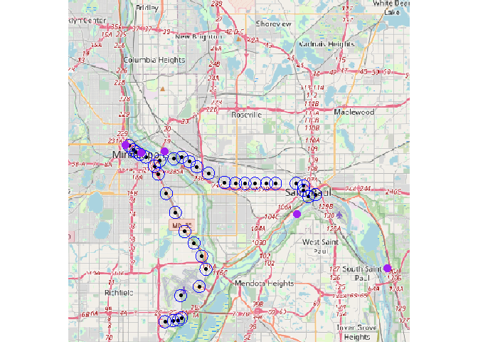
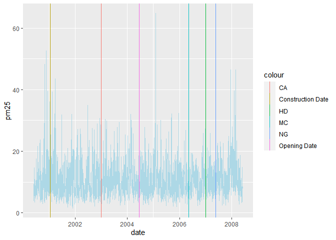

# Immmersive Research Internship Experience Project
By: Rygel Yance and Camillo Lin

## Background
This is our research project done for the University of Marlyand's Immersive Research Internship Experience (IRIE)! This work took course over a total of 8 weeks and was presented at the 2024 Summer Undergraduate Research Conference Survey.

## Research Question

Which demographic groups are impacted by light rail openings in the
United States?

## Research Context

We’re focused on the “Twin Cities”, Minneapolis and St. Paul, Minnesota
and the impact of the opening of the METRO Blue and METRO Green lines.

Timeline: 2000-2008

Hypothesis: Light rail openings decrease the pollution around stations

- Reasoning: While light rail openings gather commuters, only two of the
  stations have parking, so on average, the net PM2.5 pollution should
  in theory be lower. In addition, many of these commuters are electing
  to use the light rail instead of their own transportation, further
  contributing to a reduction in PM2.5

- Confounding Factors:

  - Power Plants

  - Recycling Centers

  - Refineries

  - Factories

  - Heating Plants

  - Paper Mills

  - Meteorological Factors

  - Local/Federal/State Policies

    - **EPA’s Heavy-Duty Engine and Vehicle Standards (2001)**: These
      standards, implemented in 2007, mandated reductions in particulate
      matter emissions from diesel engines.

    - **Clean Diesel Trucks and Buses Rule (2001)**: This rule aimed to
      reduce diesel particulate matter emissions by over 90% from 2007
      onwards.

    - **Nonroad Diesel Rule (2004)**: This rule set stringent emission
      standards for nonroad diesel engines, which took effect in stages
      starting in 2008.

    - **Minnesota Mercury Reduction Act (2006)**: While primarily
      targeting mercury, this act also required reductions in other
      pollutants, including PM2.5, from power plants.

    - **Minnesota Clean Car Rule (2007)**: This rule adopted
      California’s stricter vehicle emissions standards, which included
      measures to reduce PM2.5 emissions from cars and light trucks.

    - **Next Generation Energy Act (2007)**: This act set aggressive
      targets for reducing greenhouse gas emissions and included
      measures to increase energy efficiency and the use of renewable
      energy sources, indirectly impacting PM2.5 levels.

    - **Metropolitan Council’s Regional Development Framework (2004)**:
      This framework promoted sustainable development and reduced
      sprawl, which can help reduce vehicle emissions and PM2.5 levels.

    - **Minneapolis Green Fleet Policy (2007)**: This policy aimed to
      reduce emissions from the city’s fleet of vehicles, including
      particulate matter.

    - **Clean Air Minnesota Initiative (2005)**: This public-private
      partnership worked to reduce air pollution through voluntary
      measures, including efforts to reduce PM2.5 emissions.

    - **Minnesota’s Renewable Energy Standard (2007)**: Mandated that
      25% of the state’s electricity come from renewable sources by
      2025, reducing reliance on coal-fired power plants, a major source
      of PM2.5.

    - **Vehicle Emissions Inspection and Maintenance Programs**: These
      programs, though primarily aimed at reducing smog-forming
      pollutants, also contributed to lower PM2.5 levels by ensuring
      vehicles were properly maintained and operating efficiently.

``` r
library("knitr")
figure1 <- read.csv("Sources of Pollution - Twin Cities - Sheet1 (2).csv")
kable(figure1)
```

| Factories                                                | Notes                                                                   | Location                                   |
|:---------------------------------------------------------|:------------------------------------------------------------------------|:-------------------------------------------|
| Northern Metal Recycling, Becker, MN                     | Known for past violations related to particulate emissions.             | North Minneapolis                          |
| Flint Hills Resources Line Bend Refinery, Rosemount, MN  | Major source of industrial emissions, including various air pollutants. | Rosemount                                  |
| Xcel Energy’s Allen S. King Plant, Bayport, MN           | A coal-fired power plant contributing to emissions.                     | St. Croix River                            |
| Gerdau Ameristeel, St Paul, MN                           | A steel production facility scrutinized for particulate emissions.      | St. Paul                                   |
| 3M Cottage Grove                                         | Produces various chemicals, emitting VOCs and other pollutants          | Cottage Grove                              |
| Hennepin Energy Recovery Center (HERC)                   | A waste-to-energy facility known for emissions from burning waste.      | Minneapolis                                |
| Koch Industries (Flint Hills Resources), Minneapolis, MN | Another significant contributor from its refining operations.           | Rosemount                                  |
| Xcel Energy High Bridge Plant, St Paul, MN               | A natural gas-fired power plant contributing to air pollutants.         | St. Paul                                   |
| University of Minnesota Heating Plant, Minneapolis, MN   | Emits pollutants from burning fuel for campus energy needs.             | Minneapolis                                |
| Federal Premium Ammunition, Anoka, MN                    | Ammunition manufacturing contributing to localized air pollution.       | Anoka                                      |
| Certain Teed Corporation, Shakopee, MN                   | Produces building materials, contributing to emissions.                 | Shakopee                                   |
| UPM Blandin Paper Mill, Grand Rapids, MN                 | Paper production conributing to air emissions.                          | Grand Rapids (nearby the Twin Cities area) |

## Green & Blue Line Stations

Below is a list of all 37 stations for the METRO Green and Blue Lines.

``` r
figure2 <- read.csv("Twin Cities Stations - Sheet1.csv")
kable(figure2)
```

| Stations                             | Opening.Dates     | Address                                                                                               | Parking |
|:-------------------------------------|:------------------|:------------------------------------------------------------------------------------------------------|:--------|
| 10th Street                          | June 14, 2014     | Keefe Co. Parking 10th Street Lot 215 E 10th St Downtown St Paul, MN 55101                            | FALSE   |
| 30th Avenue                          | December 4, 2004  | 8100 30th Avenue South Bloomington, Minnesota                                                         | TRUE    |
| 38th Street                          | June 26, 2004     | 2902 38th Street East Minneapolis, Minnesota                                                          | FALSE   |
| 46th Street                          | June 26, 2004     | 3660 46th Street East Minneapolis, Minnesota                                                          | FALSE   |
| 50th Street / Minnehaha Park         | June 26, 2004     | 5010 Minnehaha Avenue Minneapolis, Minnesota                                                          | FALSE   |
| American Boulevard                   | December 12, 2009 | 34th Avenue South & East American Boulevard Bloomington, Minnesota                                    | FALSE   |
| Bloomington Central                  | December 4, 2004  | 8101 31st Avenue South Bloomington, Minnesota                                                         | FALSE   |
| Capitol / Rice Street                | June 14, 2014     | 130 University Avenue West Saint Paul, Minnesota                                                      | FALSE   |
| Cedar-Riverside                      | June 26, 2004     | 613 15th Avenue South Minneapolis, Minnesota                                                          | FALSE   |
| Central                              | June 14, 2014     | 56 Fifth Street East Saint Paul, Minnesota                                                            | FALSE   |
| Dale Street                          | June 14, 2014     | 616 University Avenue West (Eastbound) 641 University Avenue West (Westbound) Saint Paul, Minnesota   | FALSE   |
| East Bank                            | June 14, 2014     | 551 Washington Avenue Minneapolis, Minnesota                                                          | FALSE   |
| Fairview Avenue                      | June 14, 2014     | 1863 University Avenue West Saint Paul, Minnesota                                                     | FALSE   |
| Fort Snelling                        | June 26, 2004     | 6053 Minnehaha Avenue Fort Snelling, Minnesota                                                        | TRUE    |
| Franklin Avenue                      | June 26, 2004     | 1808 Franklin Avenue East Minneapolis, Minnesota                                                      | FALSE   |
| Government Plaza                     | June 24, 2004     | 352 South 5th Street Minneapolis, Minnesota                                                           | FALSE   |
| Hamline Avenue                       | June 14, 2014     | 1324 University Avenue West (Eastbound) 1359 University Avenue West (Westbound) Saint Paul, Minnesota | FALSE   |
| Lake Street / Midtown                | June 26, 2004     | 2310 Lake Street East Minneapolis, Minnesota                                                          | FALSE   |
| Lexington Parkway                    | June 14, 2014     | 1100 University Avenue West (Eastbound) 1117 University Avenue West (Westbound) Saint Paul, Minnesota | FALSE   |
| Mall of America                      | December 4, 2004  | 8240 24th Avenue South Bloomington, Minnesota                                                         | FALSE   |
| Nicollet Mall                        | June 26, 2004     | 35 South 5th Street Minneapolis, Minnesota                                                            | FALSE   |
| Prospect Park                        | June 14, 2014     | 319 29th Avenue Minneapolis, Minnesota                                                                | FALSE   |
| Raymond Avenue                       | June 14, 2014     | 2305 University Avenue West Saint Paul, Minnesota                                                     | FALSE   |
| Robert Street                        | June 14, 2014     | 613 Robert Street North Saint Paul, Minnesota                                                         | FALSE   |
| Saint Paul Union Depot               | June 14, 2014     | 214 Fourth Street East Saint Paul, Minnesota United States                                            | FALSE   |
| Snelling Avenue                      | June 14, 2014     | 1572 University Avenue West (Eastbound) 1595 University Avenue West (Westbound) Saint Paul, Minnesota | FALSE   |
| Stadium Village                      | June 14, 2014     | 2301 University Avenue Minneapolis, Minnesota                                                         | FALSE   |
| Target Field                         | November 14, 2009 | 5th Street & 3rd Avenue North Minneapolis, Minnesota                                                  | FALSE   |
| Terminal 1 - Lindbergh               | December 4, 2004  | 6450 Glumack Drive Fort Snelling, Minnesota                                                           | FALSE   |
| Terminal 2 - Humphrey                | December 4, 2004  | 7115 Humphrey Drive Fort Snelling, Minnesota                                                          | FALSE   |
| U.S. Bank Stadium                    | June 26, 2004     | 429 Park Ave South Minneapolis, Minnesota                                                             | FALSE   |
| VA Medical Center                    | June 26, 2004     | 5504 Minnehaha Avenue Fort Snelling, Minnesota                                                        | FALSE   |
| Victoria Street                      | June 14, 2014     | 844 University Avenue West (Eastbound) 875 University Avenue West (Westbound) Saint Paul, Minnesota   | FALSE   |
| Warehouse District / Hennepin Avenue | June 26, 2004     | 23 North 5th Street Minneapolis, Minnesota                                                            | FALSE   |
| West Bank                            | June 14, 2014     | 275 Cedar Avenue Minneapolis, Minnesota                                                               | FALSE   |
| Western Avenue                       | June 14, 2014     | 358 University Avenue West (Eastbound) 401 University Avenue West (Westbound) Saint Paul, Minnesota   | FALSE   |
| Westgate                             | June 14, 2014     | 2646 University Avenue West (Eastbound) 2671 University Avenue West (Westbound) Saint Paul, Minnesota | FALSE   |

## Station Information

This code reads the data from csv files we created that contains the
names of each station . The METRO Blue and Green lines in total have 37
stations. This file has the name of each station, their addresses,
opening dates, and whether or not they have parking.

``` r
library("tidyverse")
library("ggmap") 

station_data <- read.csv("Twin Cities Stations - Sheet1.csv") %>%
  mutate(Station2=paste(Stations, "Station Metro Transit, Minnesota"))
```

This next segments use a Google API key in order to get the locations of
each station of the light rail in latitude/longitude coordinates, then
fixes a few select points where the Google API failed to get a precise
location.

``` r
register_google(key = "GoogleAPIKey", write = TRUE)

addr.geo <- mutate_geocode(station_data, location = Station2, output = "latlona")
```

``` r
geo <- addr.geo %>%
  mutate(lat2 = ifelse(address=="bloomington, mn, usa", 44.85639, lat)) %>%
  mutate(lon2 = ifelse(address=="bloomington, mn, usa", -93.22628, lon)) %>%
  mutate(lat2 = ifelse(address=="minnesota, usa", 44.95648, lat2)) %>%
  mutate(lon2 = ifelse(address=="minnesota, usa", -93.17874, lon2)) %>%
  mutate(lat2 = ifelse(Station2=="Western Avenue station Metro Transit, Minnesota", 44.95586, lat2)) %>%
  mutate(lon2 = ifelse(Station2=="Western Avenue station Metro Transit, Minnesota", -93.11708, lon2))
```

## Plotting the Stations

This next code segment plots each of the station locations (in
latitude/longitude) we extracted in the previous stage

``` r
library("terra")
geo <- read.csv("stations_with_locations.csv")

sample_coords <- cbind(geo$lon2, geo$lat2)
lr_stations <- vect(sample_coords)
crdref <- "+proj=longlat +datum=WGS84"
pts <- vect(sample_coords, crs=crdref)
plot(pts)
```


## Plotting the Stations (Part 2)

This code chunk displays the station locations on top of a real map with
a 500m buffer circle around each station location. These buffers and
their sizes are to help to later extract the average PM2.5 and control
data for each of the stations individually while limiting the influence
of potential other sources of PM2.5 as well as overlap with other
stations. In addition, these buffers are necessary to get an average
reading of all the data near the station rather than relying on a single
point, which could lead to outliers.

``` r
library("terra")
library("maptiles")
```

    Warning: package 'maptiles' was built under R version 4.3.3

``` r
geo <- read.csv("stations_with_locations.csv")

pts_buffer <- buffer(pts, width = 500) # Width is measured in meters
plot(pts_buffer)
```


``` r
#writeVector(pts_buffer, "Station_Buffers.shp")

tc_lr <- vect("lr_1km_buff/lr_1km_buff.shp")
tc_lr_line <- aggregate(tc_lr, dissolve = TRUE)
lr_project <- project(tc_lr_line, "+proj=longlat + ellps = WGS84 +datum = WGS84 + nodefs")

lrc <- centroids(lr_project, inside = FALSE)

pts_buffer1 <- buffer(lrc, width = 10000)
extent <- buffer(pts, width = 600)

bg <- get_tiles(ext(extent))
plot(bg)
points(pts)
lines(pts_buffer1, col = "blue")
lines(pts_buffer, col = "red")
```


## Find Sources of Pollution near Light Rail Routes and its Addresses

This file has the name of each factory, their addresses, opening dates,
and whether or not they have parking.

``` r
library("tidyverse")
library("ggmap") 

factory_data <- read.csv("Sources of Pollution - Twin Cities - Sheet1 (2).csv") %>%
  mutate(Factory2=paste(Factories, "Factory, Minnesota"))
```

This next segments use a Google API key in order to get the locations of
each station of the light rail in latitude/longitude coordinates, then
fixes a few select points where the Google API failed to get a precise
location.

``` r
register_google(key = "GoogleAPIKey", write = TRUE)

addr.geo <- mutate_geocode(factory_data, location = Factory2, output = "latlona")
```

``` r
geo2 <- addr.geo %>%
  mutate(lat2 = ifelse(Factories=="Flint Hills Resources Line Bend Refinery, Rosemount, MN", 44.76432, lat)) %>%
  mutate(lon2 = ifelse(Factories=="Flint Hills Resources Line Bend Refinery, Rosemount, MN", -93.03947, lon)) %>%
  mutate(lat2 = ifelse(Factories=="Koch Industries (Flint Hills Resources), Rosemount, MN", 44.76424, lat2)) %>%
  mutate(lon2 = ifelse(Factories=="Koch Industries (Flint Hills Resources), Rosemount, MN", -93.03943, lon2))

write.csv(geo2, "pollution_locations.csv")
```

## Plotting the Factory Sources of Pollution

This code plots nearby sources of pollution (in purple), and where they
are located in comparison to the light rail itself. This will be
factored in later when deciding which stations may be outliers in terms
of PM2.5 air pollution.

``` r
library("terra")
geo <- read.csv("stations_with_locations.csv")
geo2 <- read.csv("pollution_locations.csv")

sample_coords <- cbind(geo$lon2, geo$lat2)
lr_stations <- vect(sample_coords)
crdref <- "+proj=longlat +datum=WGS84"
pts <- vect(sample_coords, crs=crdref)

pol_coords <- cbind(geo2$lon2, geo2$lat2)
crdref <- "+proj=longlat +datum=WGS84"
pol_pts <- vect(pol_coords, crs=crdref)

library("maptiles")

pts_buffer <- buffer(pts, width = 500) # Width is measured in meters

lrc <- centroids(lr_project, inside = FALSE)

pts_buffer1 <- buffer(lrc, width = 10000)
extent <- buffer(pts, width = 600)

bg <- get_tiles(ext(extent))
plot(bg)
points(pts)
lines(pts_buffer, col = "blue")
points(pol_pts, col = "purple", cex = 1.5)
```



## Extracting Meteorology Data

This code extracts all of the meteorology data provided by GLDAS for all
of the 3,288 days in our period of interest, cropped to the areas within
each of the station buffers. It then takes the averages of each
meteorological factor in each station then writes them to individual
dataframes to be combined in the next section. We extracted all the
meteorological factors for convenience, but we were mainly interested in
the temperature, humidity, and wind speed at each station, as these are
the meteorological factors that would have the most impact on PM2.5
pollution.

``` r
library("terra")
library("tidyverse")

#makes of list of files in that folder
files<-dir("G:/Shared drives/2024 FIRE Light Rail/DATA/GLDAS/")

for(i in 1:3288){
  r<-rast(paste0("G:/Shared drives/2024 FIRE Light Rail/DATA/GLDAS/", files[i]))

  names(r)
  #variables in page 19 of manual
  #https://hydro1.gesdisc.eosdis.nasa.gov/data/GLDAS/GLDAS_CLSM025_D.2.0/doc       /README_GLDAS2.pdf
  #Snowf_tavg<-r[[6]]
  #plot(Snowf_tavg)

  station_buffers<-vect("Station_Buffers.shp")

  #crops raster to contain only buffers around stations
  int<-crop(r, station_buffers,
            snap="in",
            mask=TRUE)

  #convert cropped raster into dataframe and find average value
  metdf<-terra::extract(int, sta, fun="mean", na.rm=TRUE)  %>% 
    summarise(across(where(is.numeric), ~ mean(.x, na.rm = TRUE))) %>%
    select(-ID)

  metdf$date<-files[i]
  
  write.csv(metdf, paste0("TC_Meteorology_Data/", files[i],".csv"), row.names = F)

}
```

## Combining the data

This code combines all of the previous data we’ve gathered into a single
dataframe, along with adding in some additional variables. This
dataframe includes each station name, each station id, the date, PM2.5,
meteorological variables, the month, day of the week, and whether or not
the day is a holiday.

``` r
library("dplyr")
library("data.table")
path<-"C:/Users/rygel/Documents/team-twin-cities/TC_Meteorology_Data/"
days<-dir(path) #makes a vector of folder names

setwd("C:/Users/rygel/Documents/team-twin-cities/TC_Meteorology_Data/")

combined_files <- bind_rows(lapply(days, fread))

setwd("C:/Users/rygel/Documents/team-twin-cities/")

write.csv(combined_files, "Full_Meteorology_Data.csv")

stations <- read.csv("Station Names and IDs.csv")

path<-"C:/Users/rygel/Documents/team-twin-cities/Twin_Cities_PM25/"
months<-dir(path) #makes a vector of folder names

setwd("C:/Users/rygel/Documents/team-twin-cities/Twin_Cities_PM25/")


combined_files <- bind_rows(lapply(months, fread))

write.csv(combined_files, "Full_PM25_Data.csv", row.names = F)

setwd("C:/Users/rygel/Documents/team-twin-cities/")

PM25 <- read.csv("Full_PM25_Data.csv")
Holidays <- read.csv("major_holidays_2000_2025.csv")
Holidays = subset(Holidays, select = -year)
Weather <- read.csv("Full_Meteorology_Data.csv")
Weather = subset(Weather, select = -X)
Weather = subset(Weather, select = -V1)
stations = read.csv("Station Names and IDs.csv")

weather_fixed_date <- Weather %>%
  mutate(date = stringr::str_extract(date, "[0-9]{4}[0-9]{2}[0-9]{2}")) %>%
  mutate(date = paste(substr(date, 1, 4), "-", substr(date, 5, 6), "-", substr(date, 7, nchar(date)), sep = ""))

pm25_fixed_date <- PM25 %>%
  mutate(date = stringr::str_extract(date, "[0-9]{4}[0-9]{2}[0-9]{2}")) %>%
  mutate(date = paste(substr(date, 1, 4), "-", substr(date, 5, 6), "-", substr(date, 7, nchar(date)), sep = ""))

pm25_stations = merge(pm25_fixed_date, stations, by = "station_num")

add_weather = merge(pm25_stations, weather_fixed_date, by = "date", all.x = TRUE, all.y = FALSE)

add_holidays = merge(add_weather, Holidays, by = "date", all.x = TRUE, all.y = FALSE)

full_fixed_cols <- add_holidays %>%
  mutate(holiday = ifelse(is.na(holiday), FALSE, TRUE)) %>%
  mutate(day_of_week = weekdays(as.Date(date))) %>%
  mutate(month = months(as.Date(date)))

date_stations_sorted <- full_fixed_cols[order(full_fixed_cols$date, full_fixed_cols$station_num),]

write.csv(date_stations_sorted, "Mega_Dataframe.csv", row.names = F)
```

## Plotting PM2.5 of the different stations over time

This code plots a boxplot for the PM2.5 on each date from 2000-2008 for
each station as well as finds the differences in average PM2.5 before
and after the opening of the METRO Blue Line on June 14th, 2004. Using
this data as well as factoring in parking and other pollution sources,
we have decided to remove stations 1, 16, 28, and 34 from our data.

``` r
library(ggplot2)

all_data = read.csv("Mega_Dataframe.csv")
half_data = head(all_data, 120398)
truncated_data = head(all_data, 60199)
truncated_data2 = head(tail(all_data, -60199), 60199)

ggplot(data = half_data, aes(x = station_num, y = pm25)) +
  geom_boxplot(outlier.shape = NA, aes(group = station_num, color = factor(station_num))) +
  ylim(0, 25)
```


``` r
#ggplot(data = truncated_data, aes(x = station_num, y = pm25)) +
  #geom_boxplot(outlier.shape = NA, aes(group = station_num, color = #factor(station_num))) +
  #ylim(0, 25)

#ggplot(data = truncated_data2, aes(x = station_num, y = pm25)) +
  #geom_boxplot(outlier.shape = NA, aes(group = station_num, color = #factor(station_num))) +
  #ylim(0, 25)

before_mean<- aggregate(x=truncated_data$pm25,
                      # Specify group indicator
                      by = list(truncated_data$station_num),      
                      # Specify function (i.e. mean)
                      FUN = mean)

after_mean<- aggregate(x=truncated_data2$pm25,
                      # Specify group indicator
                      by = list(truncated_data2$station_num),      
                      # Specify function (i.e. mean)
                      FUN = mean)


b = before_mean$x
a = after_mean$x
```

## Setting Relevant Dates

The following code sets a list of dates for the relevant start and end
dates for the period of interest (June 2000 - June 2008), the opening of
the Metro Blue Line, the date when construction on the Blue Line began,
and a list of dates when relevant policies that might impact the level
of PM2.5 were enacted.

These policies include the Heavy-Duty Engine and Vehicle Standards,
which mandated reductions in particulate matter emissions from diesel
engines (EPA’s Heavy-Duty Engine and Vehicle Standards, 2001), the
Nonroad Diesel Rule, which set stringent emission standards for nonroad
diesel engines (Nonroad Diesel Rule, 2004), the Minnesota Mercury
Reduction Act, which aimed to reduce mercury and other pollutants from
power plants (Minnesota Mercury Reduction Act, 2006), the Next Gen
Energy Act, which set aggressive targets for reducing greenhouse gas
emissions and included measures to increase energy efficiency and the
use of renewable energy sources (Next Generation Energy Act, 2007), the
2030 Regional Development Framework, which promoted sustainable
development and reduced sprawl (2030 Regional Development Framework,
2004), the Clean Air Minnesota Initiative, which worked to reduce air
pollution through voluntary measures (Clean Air Minnesota Initiative,
2005), the Minnesota Renewable Energy Standard, which mandated that 25%
of the state’s electricity must come from renewable sources by 2025
(Minnesota Renewable Energy Standard, 2007), and the vehicle emissions
inspection and maintenance programs, which were aimed at reducing
smog-forming pollutants and ensuring vehicles were properly maintained
and efficient (Vehicle Emissions Inspection and Maintenance Programs,
2001).

``` r
library("tidyverse")
```

``` r
df <- read.csv("Mega_Dataframe.csv")
```

``` r
df2 <- df %>%
  mutate(date = as.Date(date, format = '%Y-%m-%d'))
```

``` r
# Period of Analysis
startdate <- as.Date("2000-06-01", format = '%Y-%m-%d')
enddate <- as.Date("2008-06-01", format = '%Y-%m-%d')
opendate <- as.Date("2004-06-14", format = "%Y-%m-%d")
conststart <- as.Date("2001-01-17", format = "%Y-%m-%d")
#Heavy-Duty Engine and Vehicle Standards
HD_Engine <- as.Date("2007-01-01", format = "%Y-%m-%d")
#Nonroad Diesel Rule
NR_Diesel <- as.Date("2004-06-29", format = "%Y-%m-%d")
#Minnesota Mercury Reduction Act
MC_Reduction <- as.Date("2006-05-11", format = "%Y-%m-%d")
#Next Gen Energy Act
NG_Energy <- as.Date("2007-05-25", format = "%Y-%m-%d")
#2030 Regional Development Framework
RDF <- as.Date("2004-01-01", format = "%Y-%m-%d")
#Clean Air Minnesota Initiative
CA_Init <- as.Date("2003-01-01", format = "%Y-%m-%d")
#Minnesota Renewable Energy Standard
RE_Standard <- as.Date("2001-01-01", format = "%Y-%m-%d")
#Vehicle Emissions Inspection and Maintenance Programs
VE_Programs <- as.Date("2001-04-05", format = "%Y-%m-%d")
```

## Adding DB-OLS Variables

The following code limits the data to the aforementioned period of
interest and adds dummy variable columns for the day of the week fixed
effects, the opening date of the metro, the start of construction date,
the temperature, humidity, and wind speed and their lag polynomials, the
time in days and its polynomials, and finally a column for each of the
relevant policies from the previous section. The time and weather
polynomials are to replicate the methodology of (Chen & Whalley, 2012).

``` r
df3 <- df2 %>%
  filter(date>=startdate & date <= enddate) %>%
  mutate(MetroOpen = ifelse(date >= opendate, 1, 0)) %>%
  mutate(dow = wday(date)) %>%
  mutate(construction = ifelse(date > conststart & date < opendate, 1, 0)) %>%
  group_by(station_num) %>%
  arrange(station_num, date) %>%
  mutate(t = as.numeric(date-startdate)) %>%
  mutate(t2 = t^2, t3 = t^3, t4 = t^4) %>%
  mutate(l_tair = lag(Tair_f_tavg)) %>%
  mutate(l_tair_2 = l_tair^2) %>%
  mutate(l_tair_3 = l_tair^3) %>%
  mutate(l_tair_4 = l_tair^4) %>%
  mutate(l_qair = lag(Qair_f_tavg)) %>%
  mutate(l_qair_2 = l_qair^2) %>%
  mutate(l_qair_3 = l_qair^3) %>%
  mutate(l_qair_4 = l_qair^4) %>%
  mutate(l_wind = lag(Wind_f_tavg)) %>%
  mutate(l_wind_2 = l_wind^2) %>%
  mutate(l_wind_3 = l_wind^3) %>%
  mutate(l_wind_4 = l_wind^4) %>%
  mutate(CA_Init = ifelse(date >= CA_Init, 1, 0)) %>%
  mutate(HD_Engine = ifelse(date >= HD_Engine, 1, 0)) %>%
  mutate(MC_Reduction = ifelse(date >= MC_Reduction, 1, 0)) %>%
  mutate(NG_Energy = ifelse(date >= NG_Energy, 1, 0)) %>%
  mutate(NR_Diesel = ifelse(date >= NR_Diesel, 1, 0)) %>%
  mutate(RDF = ifelse(date >= RDF, 1, 0)) %>%
  mutate(RE_Standard = ifelse(date >= RE_Standard, 1, 0)) %>%
  mutate(VE_Programs = ifelse(date >= VE_Programs, 1, 0))
```

## Running Regression Models

The following code blocks run various regression models including
different control factors each time. The results from these regressions
have been collected into the table below:

| X                        | log.PM2.5.   | X.1   | X.2           | X.3           | X.4           | X.5           | X.6           |
|:-------------------------|:-------------|:------|:--------------|:--------------|:--------------|:--------------|:--------------|
| MetroOpen                | 0.020 \*\*\* | 0.009 | -0.074 \*\*\* | -0.074 \*\*\* | -0.183 \*\*\* | -0.239 \*\*\* | -0.232 \*\*\* |
| Regulation Dummies       |              |       |               |               |               | x             | x             |
| Weather Polynomials      |              |       | x             | x             | x             | x             | x             |
| Construction Dummy       |              | x     | x             | x             | x             | x             | x             |
| Month FE                 |              | x     | x             | x             | x             | x             | x             |
| Day of Week FE           |              | x     | x             | x             | x             | x             | x             |
| Holiday Dummy            |              |       |               | x             | x             | x             | x             |
| t, t^2, t^3, t^4         |              |       |               |               | x             | x             | x             |
| Exclude outlier stations |              |       |               |               |               |               | x             |

This code block runs a simple regression without any of the control
factors (Column “log.PM2.5” in table).

``` r
summary(m1 <- lm(log(pm25) ~ MetroOpen, data = df3))
```

This code block runs a regression with the construction, month fixed
effects, and day fixed effects added (Column “X.1” in table).

``` r
summary(m1 <- lm(log(pm25) ~ MetroOpen +
                   construction +
                   as.factor(month) +
                   as.factor(dow)
                   , data = df3))
```

This regression adds the weather polynomials to the previous one (Column
“X.2” in table).

``` r
summary(m1 <- lm(log(pm25) ~ MetroOpen +
                   construction +
                   Tair_f_tavg +
                   l_tair +
                   l_tair_2 +
                   l_tair_3 +
                   l_tair_4 +
                   Qair_f_tavg +
                   l_qair +
                   l_qair_2 +
                   l_qair_3 +
                   l_qair_4 +
                   Wind_f_tavg +
                   l_wind +
                   l_wind_2 +
                   l_wind_3 +
                   l_wind_4 +
                   as.factor(month) +
                   as.factor(dow)
                   , data = df3))
```

This block adds the holiday control variable into the regression (Column
“X.3” in table).

``` r
summary(m1 <- lm(log(pm25) ~ MetroOpen +
                   construction +
                   Tair_f_tavg +
                   l_tair +
                   l_tair_2 +
                   l_tair_3 +
                   l_tair_4 +
                   Qair_f_tavg +
                   l_qair +
                   l_qair_2 +
                   l_qair_3 +
                   l_qair_4 +
                   Wind_f_tavg +
                   l_wind +
                   l_wind_2 +
                   l_wind_3 +
                   l_wind_4 +
                   holiday +
                   as.factor(month) +
                   as.factor(dow)
                   , data = df3))
```

This block adds the time polynomials into the regression (Column “X.4”
in table).

``` r
summary(m1 <- lm(log(pm25) ~ MetroOpen +
                   construction +
                   Tair_f_tavg +
                   l_tair +
                   l_tair_2 +
                   l_tair_3 +
                   l_tair_4 +
                   Qair_f_tavg +
                   l_qair +
                   l_qair_2 +
                   l_qair_3 +
                   l_qair_4 +
                   Wind_f_tavg +
                   l_wind +
                   l_wind_2 +
                   l_wind_3 +
                   l_wind_4 +
                   holiday +
                   t +
                   t2 +
                   t3 +
                   t4 +
                   as.factor(month) +
                   as.factor(dow)
                   , data = df3))
```

This block adds the relevant policies for PM2.5 into the regression
(Column “X.5” in table).

``` r
summary(m1 <- lm(log(pm25) ~ MetroOpen +
                   construction +
                   Tair_f_tavg +
                   l_tair +
                   l_tair_2 +
                   l_tair_3 +
                   l_tair_4 +
                   Qair_f_tavg +
                   l_qair +
                   l_qair_2 +
                   l_qair_3 +
                   l_qair_4 +
                   Wind_f_tavg +
                   l_wind +
                   l_wind_2 +
                   l_wind_3 +
                   l_wind_4 +
                   holiday +
                   t +
                   t2 +
                   t3 +
                   t4 +
                   CA_Init +
                   HD_Engine +
                   MC_Reduction +
                   NG_Energy +
                   NR_Diesel +
                   RDF +
                   RE_Standard +
                   VE_Programs +
                   as.factor(month) +
                   as.factor(dow)
                   , data = df3))
```

Finally, this block removes the stations which were determined to be
outliers (1, 16, 28, 34) into the regression (Column “X.6” in table).

``` r
df4 <- df3 %>%
  filter(station_num != 1 & station_num != 16 & station_num != 28 & station_num != 34)

summary(m1 <- lm(log(pm25) ~ MetroOpen +
                   construction +
                   Tair_f_tavg +
                   l_tair +
                   l_tair_2 +
                   l_tair_3 +
                   l_tair_4 +
                   Qair_f_tavg +
                   l_qair +
                   l_qair_2 +
                   l_qair_3 +
                   l_qair_4 +
                   Wind_f_tavg +
                   l_wind +
                   l_wind_2 +
                   l_wind_3 +
                   l_wind_4 +
                   holiday +
                   t +
                   t2 +
                   t3 +
                   t4 +
                   CA_Init +
                   HD_Engine +
                   MC_Reduction +
                   NG_Energy +
                   NR_Diesel +
                   RDF +
                   RE_Standard +
                   VE_Programs +
                   as.factor(month) +
                   as.factor(dow)
                   , data = df4))
```

## Timeline

This graph shows the average PM2.5 across all 37 stations over time
along with relevant events plotted as vertical lines.

``` r
df5 <- df3 %>%
  group_by(date) %>%
  summarise(pm25 = mean(pm25))
ggplot(data = df5, aes(x = date, y = pm25)) +
  geom_line(col = "lightblue") +
  geom_vline(aes(xintercept = opendate, col = "Opening Date")) + 
  geom_vline(aes(xintercept = conststart, col = "Construction Date")) + 
  geom_vline(aes(xintercept = CA_Init, col = "CA")) +
  geom_vline(aes(xintercept = HD_Engine, col = "HD")) +
  geom_vline(aes(xintercept = MC_Reduction, col = "MC")) +
  geom_vline(aes(xintercept = NG_Energy, col = "NG"))
```



# Calculating Station-Level Pollution Change

``` r
library("tidyverse")
library("knitr")
```

This chunk uploads the full data frame required to estimate the impact
of light rails on PM2.5 levels surrounding all stations

``` r
df<-read.csv("Mega_Dataframe.csv") 

df2<-df %>%
  mutate(date=as.Date(date, format='%Y-%m-%d'))

#period of analysis
startdate<-as.Date("2000-06-01", format='%Y-%m-%d')
enddate<-as.Date("2008-06-01", format='%Y-%m-%d')

#opening data of metro
opendate<-as.Date("2004-06-14", format='%Y-%m-%d')

#date when groundbreak starts
conststart <- as.Date("2001-01-17", format = "%Y-%m-%d")

#Heavy-Duty Engine and Vehicle Standards
HD_Engine <- as.Date("2007-01-01", format = "%Y-%m-%d")
#Nonroad Diesel Rule
NR_Diesel <- as.Date("2004-06-29", format = "%Y-%m-%d")
#Minnesota Mercury Reduction Act
MC_Reduction <- as.Date("2006-05-11", format = "%Y-%m-%d")
#Next Gen Energy Act
NG_Energy <- as.Date("2007-05-25", format = "%Y-%m-%d")
#2030 Regional Development Framework
RDF <- as.Date("2004-01-01", format = "%Y-%m-%d")
#Clean Air Minnesota Initiative
CA_Init <- as.Date("2003-01-01", format = "%Y-%m-%d")
#Minnesota Renewable Energy Standard
RE_Standard <- as.Date("2001-01-01", format = "%Y-%m-%d")
#Vehicle Emissions Inspection and Maintenance Programs
VE_Programs <- as.Date("2001-04-05", format = "%Y-%m-%d")

df3 <- df2 %>%
  filter(date>=startdate & date <= enddate) %>%
  mutate(MetroOpen = ifelse(date >= opendate, 1, 0)) %>%
  mutate(dow = wday(date)) %>%
  mutate(construction = ifelse(date > conststart & date < opendate, 1, 0)) %>%
  group_by(station_num) %>%
  arrange(station_num, date) %>%
  mutate(t = as.numeric(date-startdate)) %>%
  mutate(t2 = t^2, t3 = t^3, t4 = t^4) %>%
  mutate(l_tair = lag(Tair_f_tavg)) %>%
  mutate(l_tair_2 = l_tair^2) %>%
  mutate(l_tair_3 = l_tair^3) %>%
  mutate(l_tair_4 = l_tair^4) %>%
  mutate(l_qair = lag(Qair_f_tavg)) %>%
  mutate(l_qair_2 = l_qair^2) %>%
  mutate(l_qair_3 = l_qair^3) %>%
  mutate(l_qair_4 = l_qair^4) %>%
  mutate(l_wind = lag(Wind_f_tavg)) %>%
  mutate(l_wind_2 = l_wind^2) %>%
  mutate(l_wind_3 = l_wind^3) %>%
  mutate(l_wind_4 = l_wind^4) %>%
  mutate(CA_Init = ifelse(date >= CA_Init, 1, 0)) %>%
  mutate(HD_Engine = ifelse(date >= HD_Engine, 1, 0)) %>%
  mutate(MC_Reduction = ifelse(date >= MC_Reduction, 1, 0)) %>%
  mutate(NG_Energy = ifelse(date >= NG_Energy, 1, 0)) %>%
  mutate(NR_Diesel = ifelse(date >= NR_Diesel, 1, 0)) %>%
  mutate(RDF = ifelse(date >= RDF, 1, 0)) %>%
  mutate(RE_Standard = ifelse(date >= RE_Standard, 1, 0)) %>%
  mutate(VE_Programs = ifelse(date >= VE_Programs, 1, 0))
```

This runs a station-level regression using the same regression model as
used for column “X.4” in the regression table above.

``` r
summary(m1 <- lm(log(pm25) ~ MetroOpen:as.factor(station_num) +
                   construction +
                   Tair_f_tavg +
                   l_tair +
                   l_tair_2 +
                   l_tair_3 +
                   l_tair_4 +
                   Qair_f_tavg +
                   l_qair +
                   l_qair_2 +
                   l_qair_3 +
                   l_qair_4 +
                   Wind_f_tavg +
                   l_wind +
                   l_wind_2 +
                   l_wind_3 +
                   l_wind_4 +
                   holiday +
                   t +
                   t2 +
                   t3 +
                   t4 +
                   as.factor(month) +
                   as.factor(dow)
                   , data = df3))
```


    Call:
    lm(formula = log(pm25) ~ MetroOpen:as.factor(station_num) + construction + 
        Tair_f_tavg + l_tair + l_tair_2 + l_tair_3 + l_tair_4 + Qair_f_tavg + 
        l_qair + l_qair_2 + l_qair_3 + l_qair_4 + Wind_f_tavg + l_wind + 
        l_wind_2 + l_wind_3 + l_wind_4 + holiday + t + t2 + t3 + 
        t4 + as.factor(month) + as.factor(dow), data = df3)

    Residuals:
         Min       1Q   Median       3Q      Max 
    -2.05105 -0.29451  0.00039  0.31805  1.64288 

    Coefficients:
                                         Estimate Std. Error t value Pr(>|t|)    
    (Intercept)                        -3.082e+03  5.743e+02  -5.367 8.04e-08 ***
    construction                       -1.765e-01  1.241e-02 -14.215  < 2e-16 ***
    Tair_f_tavg                         8.146e-03  5.634e-04  14.458  < 2e-16 ***
    l_tair                              4.285e+01  8.324e+00   5.148 2.64e-07 ***
    l_tair_2                           -2.215e-01  4.517e-02  -4.904 9.42e-07 ***
    l_tair_3                            5.043e-04  1.088e-04   4.636 3.55e-06 ***
    l_tair_4                           -4.266e-07  9.810e-08  -4.348 1.37e-05 ***
    Qair_f_tavg                         5.139e+01  1.214e+00  42.342  < 2e-16 ***
    l_qair                              3.728e+02  2.160e+01  17.261  < 2e-16 ***
    l_qair_2                           -5.320e+04  3.028e+03 -17.569  < 2e-16 ***
    l_qair_3                            3.152e+06  1.769e+05  17.820  < 2e-16 ***
    l_qair_4                           -6.650e+07  3.638e+06 -18.277  < 2e-16 ***
    Wind_f_tavg                        -9.715e-02  1.563e-03 -62.140  < 2e-16 ***
    l_wind                              5.594e-02  6.944e-02   0.806 0.420507    
    l_wind_2                           -3.938e-02  2.612e-02  -1.508 0.131670    
    l_wind_3                            5.261e-03  4.123e-03   1.276 0.201944    
    l_wind_4                           -2.305e-04  2.307e-04  -0.999 0.317755    
    holidayTRUE                        -2.014e-02  7.976e-03  -2.525 0.011563 *  
    t                                   9.674e-05  6.239e-05   1.550 0.121027    
    t2                                  1.959e-07  7.337e-08   2.670 0.007590 ** 
    t3                                 -2.120e-10  3.335e-11  -6.355 2.09e-10 ***
    t4                                  5.006e-14  5.240e-15   9.552  < 2e-16 ***
    as.factor(month)August             -4.981e-01  1.035e-02 -48.111  < 2e-16 ***
    as.factor(month)December            4.102e-01  9.178e-03  44.698  < 2e-16 ***
    as.factor(month)February            4.716e-01  9.636e-03  48.938  < 2e-16 ***
    as.factor(month)January             3.959e-01  9.626e-03  41.128  < 2e-16 ***
    as.factor(month)July               -6.433e-01  1.126e-02 -57.120  < 2e-16 ***
    as.factor(month)June               -5.285e-01  1.012e-02 -52.203  < 2e-16 ***
    as.factor(month)March               2.995e-01  8.032e-03  37.290  < 2e-16 ***
    as.factor(month)May                -2.632e-01  7.560e-03 -34.811  < 2e-16 ***
    as.factor(month)November            2.423e-01  7.659e-03  31.635  < 2e-16 ***
    as.factor(month)October            -6.053e-02  7.373e-03  -8.209 2.26e-16 ***
    as.factor(month)September          -3.364e-01  8.743e-03 -38.481  < 2e-16 ***
    as.factor(dow)2                     2.120e-02  5.240e-03   4.046 5.22e-05 ***
    as.factor(dow)3                     2.000e-02  5.239e-03   3.817 0.000135 ***
    as.factor(dow)4                     2.725e-02  5.240e-03   5.201 1.99e-07 ***
    as.factor(dow)5                     8.576e-03  5.231e-03   1.640 0.101111    
    as.factor(dow)6                     3.025e-02  5.253e-03   5.758 8.56e-09 ***
    as.factor(dow)7                     5.619e-02  5.247e-03  10.710  < 2e-16 ***
    MetroOpen:as.factor(station_num)1  -9.622e-02  1.753e-02  -5.489 4.05e-08 ***
    MetroOpen:as.factor(station_num)2  -2.299e-01  1.753e-02 -13.117  < 2e-16 ***
    MetroOpen:as.factor(station_num)3  -2.479e-01  1.753e-02 -14.143  < 2e-16 ***
    MetroOpen:as.factor(station_num)4  -2.190e-01  1.753e-02 -12.491  < 2e-16 ***
    MetroOpen:as.factor(station_num)5  -1.844e-01  1.753e-02 -10.520  < 2e-16 ***
    MetroOpen:as.factor(station_num)6  -2.299e-01  1.753e-02 -13.117  < 2e-16 ***
    MetroOpen:as.factor(station_num)7  -2.299e-01  1.753e-02 -13.117  < 2e-16 ***
    MetroOpen:as.factor(station_num)8  -1.731e-01  1.753e-02  -9.875  < 2e-16 ***
    MetroOpen:as.factor(station_num)9  -1.464e-01  1.753e-02  -8.352  < 2e-16 ***
    MetroOpen:as.factor(station_num)10 -9.622e-02  1.753e-02  -5.489 4.05e-08 ***
    MetroOpen:as.factor(station_num)11 -1.596e-01  1.753e-02  -9.107  < 2e-16 ***
    MetroOpen:as.factor(station_num)12 -1.753e-01  1.753e-02 -10.002  < 2e-16 ***
    MetroOpen:as.factor(station_num)13 -1.763e-01  1.753e-02 -10.058  < 2e-16 ***
    MetroOpen:as.factor(station_num)14 -1.690e-01  1.753e-02  -9.643  < 2e-16 ***
    MetroOpen:as.factor(station_num)15 -1.655e-01  1.753e-02  -9.440  < 2e-16 ***
    MetroOpen:as.factor(station_num)16 -2.158e-01  1.753e-02 -12.309  < 2e-16 ***
    MetroOpen:as.factor(station_num)17 -1.795e-01  1.753e-02 -10.242  < 2e-16 ***
    MetroOpen:as.factor(station_num)18 -2.239e-01  1.753e-02 -12.773  < 2e-16 ***
    MetroOpen:as.factor(station_num)19 -1.852e-01  1.753e-02 -10.568  < 2e-16 ***
    MetroOpen:as.factor(station_num)20 -2.735e-01  1.753e-02 -15.602  < 2e-16 ***
    MetroOpen:as.factor(station_num)21 -2.158e-01  1.753e-02 -12.309  < 2e-16 ***
    MetroOpen:as.factor(station_num)22 -1.592e-01  1.753e-02  -9.083  < 2e-16 ***
    MetroOpen:as.factor(station_num)23 -1.814e-01  1.753e-02 -10.346  < 2e-16 ***
    MetroOpen:as.factor(station_num)24 -1.158e-01  1.753e-02  -6.604 4.03e-11 ***
    MetroOpen:as.factor(station_num)25 -1.066e-01  1.753e-02  -6.082 1.19e-09 ***
    MetroOpen:as.factor(station_num)26 -1.830e-01  1.753e-02 -10.442  < 2e-16 ***
    MetroOpen:as.factor(station_num)27 -1.660e-01  1.753e-02  -9.471  < 2e-16 ***
    MetroOpen:as.factor(station_num)28 -2.158e-01  1.753e-02 -12.309  < 2e-16 ***
    MetroOpen:as.factor(station_num)29 -1.401e-01  1.753e-02  -7.991 1.35e-15 ***
    MetroOpen:as.factor(station_num)30 -2.152e-01  1.753e-02 -12.276  < 2e-16 ***
    MetroOpen:as.factor(station_num)31 -1.811e-01  1.753e-02 -10.332  < 2e-16 ***
    MetroOpen:as.factor(station_num)32 -1.668e-01  1.753e-02  -9.517  < 2e-16 ***
    MetroOpen:as.factor(station_num)33 -1.794e-01  1.753e-02 -10.233  < 2e-16 ***
    MetroOpen:as.factor(station_num)34 -2.158e-01  1.753e-02 -12.309  < 2e-16 ***
    MetroOpen:as.factor(station_num)35 -1.797e-01  1.753e-02 -10.250  < 2e-16 ***
    MetroOpen:as.factor(station_num)36 -1.763e-01  1.753e-02 -10.058  < 2e-16 ***
    MetroOpen:as.factor(station_num)37 -2.033e-01  1.753e-02 -11.597  < 2e-16 ***
    ---
    Signif. codes:  0 '***' 0.001 '**' 0.01 '*' 0.05 '.' 0.1 ' ' 1

    Residual standard error: 0.4579 on 108038 degrees of freedom
      (37 observations deleted due to missingness)
    Multiple R-squared:  0.1909,    Adjusted R-squared:  0.1903 
    F-statistic: 339.8 on 75 and 108038 DF,  p-value: < 2.2e-16

The code below prints out the station-level effect and the p-values

``` r
c <- coef(m1)
len_coef<-length(coef(m1))

#get coefficients of the station-level effect
coef<-coef(m1)[(len_coef-36): len_coef]

#get p values of the station-level effect (p<0.05 is statistically significant)
pval<-summary(m1)$coefficients[,4][(len_coef-3): len_coef]

kable(cbind(coef, pval), digits=2)
```

    Warning in cbind(coef, pval): number of rows of result is not a multiple of
    vector length (arg 2)

|                                    |  coef | pval |
|:-----------------------------------|------:|-----:|
| MetroOpen:as.factor(station_num)1  | -0.10 |    0 |
| MetroOpen:as.factor(station_num)2  | -0.23 |    0 |
| MetroOpen:as.factor(station_num)3  | -0.25 |    0 |
| MetroOpen:as.factor(station_num)4  | -0.22 |    0 |
| MetroOpen:as.factor(station_num)5  | -0.18 |    0 |
| MetroOpen:as.factor(station_num)6  | -0.23 |    0 |
| MetroOpen:as.factor(station_num)7  | -0.23 |    0 |
| MetroOpen:as.factor(station_num)8  | -0.17 |    0 |
| MetroOpen:as.factor(station_num)9  | -0.15 |    0 |
| MetroOpen:as.factor(station_num)10 | -0.10 |    0 |
| MetroOpen:as.factor(station_num)11 | -0.16 |    0 |
| MetroOpen:as.factor(station_num)12 | -0.18 |    0 |
| MetroOpen:as.factor(station_num)13 | -0.18 |    0 |
| MetroOpen:as.factor(station_num)14 | -0.17 |    0 |
| MetroOpen:as.factor(station_num)15 | -0.17 |    0 |
| MetroOpen:as.factor(station_num)16 | -0.22 |    0 |
| MetroOpen:as.factor(station_num)17 | -0.18 |    0 |
| MetroOpen:as.factor(station_num)18 | -0.22 |    0 |
| MetroOpen:as.factor(station_num)19 | -0.19 |    0 |
| MetroOpen:as.factor(station_num)20 | -0.27 |    0 |
| MetroOpen:as.factor(station_num)21 | -0.22 |    0 |
| MetroOpen:as.factor(station_num)22 | -0.16 |    0 |
| MetroOpen:as.factor(station_num)23 | -0.18 |    0 |
| MetroOpen:as.factor(station_num)24 | -0.12 |    0 |
| MetroOpen:as.factor(station_num)25 | -0.11 |    0 |
| MetroOpen:as.factor(station_num)26 | -0.18 |    0 |
| MetroOpen:as.factor(station_num)27 | -0.17 |    0 |
| MetroOpen:as.factor(station_num)28 | -0.22 |    0 |
| MetroOpen:as.factor(station_num)29 | -0.14 |    0 |
| MetroOpen:as.factor(station_num)30 | -0.22 |    0 |
| MetroOpen:as.factor(station_num)31 | -0.18 |    0 |
| MetroOpen:as.factor(station_num)32 | -0.17 |    0 |
| MetroOpen:as.factor(station_num)33 | -0.18 |    0 |
| MetroOpen:as.factor(station_num)34 | -0.22 |    0 |
| MetroOpen:as.factor(station_num)35 | -0.18 |    0 |
| MetroOpen:as.factor(station_num)36 | -0.18 |    0 |
| MetroOpen:as.factor(station_num)37 | -0.20 |    0 |

# Query demographic data

Helpful resource:
<https://walker-data.com/tidycensus/articles/basic-usage.html>

Get census key

``` r
library(tidycensus)
api_key <- "Your_Census_API_Key"
census_api_key(api_key, install=TRUE, overwrite = T)
readRenviron("~/.Renviron")
```

Identify variables for querying

``` r
vars<-load_variables(year=2000, dataset="sf1", cache = TRUE)
```

Query variables (The codes represent all age groups for male and female
and will be renamed in the next step). We chose age groups in particular
because we believe there could be a disparity between how much the light
rail impacts younger vs. older people. Since younger people such as
teenagers and college students without their own means of transportation
may have a higher likelihood of using the light rail, we believe they
may be more affected.

``` r
targetvars<-c("P012002", "P012003", "P012004", "P012005", "P012006", "P012007", "P012008", "P012009", "P012010", "P012011", "P012012", "P012013", "P012014", "P012015", "P012016", "P012017", "P012018", "P012019", "P012020", "P012021", "P012022", "P012023", "P012024", "P012025", "P012026", "P012027", "P012028", "P012029", "P012030", "P012031", "P012032", "P012033", "P012034", "P012035", "P012036", "P012037", "P012038", "P012039", "P012040", "P012041", "P012042", "P012043", "P012044", "P012045", "P012046", "P012047", "P012048", "P012049")

age1<-get_decennial(year = 2000, geography = "block", variables=targetvars, state="MN", county="Hennepin", output="wide")
age2<-get_decennial(year = 2000, geography = "block", variables=targetvars, state="MN", county="Ramsey", output="wide")
age<-rbind(age1,age2)
```

Rename columns

``` r
age_ranges<-age %>%
  rename(total_male="P012002", total_male_under_5_years="P012003", total_male_5_to_9_years="P012004", total_male_10_to_14_years="P012005", total_male_15_to_17_years="P012006", total_male_18_and_19_years="P012007", total_male_20_years="P012008", total_male_21_years="P012009", total_male_22_to_24_years="P012010", total_male_25_to_29_years="P012011", total_male_30_to_34_years="P012012", total_male_35_to_39_years="P012013", total_male_40_to_44_years="P012014", total_male_45_to_49_years="P012015", total_male_50_to_54_years="P012016", total_male_55_to_59_years="P012017", total_male_60_and_61_years="P012018", total_male_62_to_64_years="P012019", total_male_65_and_66_years="P012020", total_male_67_to_69_years="P012021", total_male_70_to_74_years="P012022", total_male_75_to_79_years="P012023", total_male_80_to_84_years="P012024", total_male_85_years_and_over="P012025", total_female="P012026", total_female_under_5_years="P012027", total_female_5_to_9_years="P012028", total_female_10_to_14_years="P012029", total_female_15_to_17_years="P012030", total_female_18_and_19_years="P012031", total_female_20_years="P012032", total_female_21_years="P012033", total_female_22_to_24_years="P012034", total_female_25_to_29_years="P012035", total_female_30_to_34_years="P012036", total_female_35_to_39_years="P012037", total_female_40_to_44_years="P012038", total_female_45_to_49_years="P012039", total_female_50_to_54_years="P012040", total_female_55_to_59_years="P012041", total_female_60_and_61_years="P012042", total_female_62_to_64_years="P012043", total_female_65_and_66_years="P012044", total_female_67_to_69_years="P012045", total_female_70_to_74_years="P012046", total_female_75_to_79_years="P012047", total_female_80_to_84_years="P012048", total_female_85_years_and_over="P012049")
```

# Calculate affected demographic group

``` r
library("terra")
```

``` r
buff<-vect("Station_Buffers.shp")
plot(buff)
```

Download shapefiles from [tigris
package](https://github.com/walkerke/tigris)

``` r
shape<-tigris::blocks(state="MN", county="Ramsey", class="sp", year=2000)
shape2<-tigris::blocks(state="MN", county="Hennepin", class="sp", year=2000)
shapevect1<-vect(shape)
shapevect2<-vect(shape2)
shapevect<-rbind(shapevect1, shapevect2)
shapedf<-as.data.frame(shapevect)

buff2 <- subset(buff, buff$FID == 19)
plot(buff)
lines(buff2, col = 'purple')
```

``` r
blockage<-merge(shapevect, age_ranges, by.x="BLKIDFP00", by.y="GEOID")

blockage$blockarea<-expanse(blockage, unit="m")

blockagedf<-as.data.frame(blockage)

summary(blockagedf)

#100 percent match
```

Intersect blocks with buffers

``` r
output<-c()

for (i in 0:36) {
  buff2 <- subset(buff, buff$FID == i)

  int<-crop(blockage, buff2)

  int$intarea<-expanse(int, unit="m")

  intdf<-as.data.frame(int)%>%
    mutate(frac_area=intarea/blockarea) %>%
    mutate(total_male=total_male*frac_area, 
         total_male_under_5_years=total_male_under_5_years*frac_area, 
         total_male_5_to_9_years=total_male_5_to_9_years*frac_area, 
         total_male_10_to_14_years=total_male_10_to_14_years*frac_area, 
         total_male_15_to_17_years=total_male_15_to_17_years*frac_area, 
         total_male_18_and_19_years=total_male_18_and_19_years*frac_area, 
         total_male_20_years=total_male_20_years*frac_area, 
         total_male_21_years=total_male_21_years*frac_area, 
         total_male_22_to_24_years=total_male_22_to_24_years*frac_area, 
         total_male_25_to_29_years=total_male_25_to_29_years*frac_area, 
         total_male_30_to_34_years=total_male_30_to_34_years*frac_area, 
         total_male_35_to_39_years=total_male_35_to_39_years*frac_area, 
         total_male_40_to_44_years=total_male_40_to_44_years*frac_area, 
         total_male_45_to_49_years=total_male_45_to_49_years*frac_area, 
         total_male_50_to_54_years=total_male_50_to_54_years*frac_area, 
         total_male_55_to_59_years=total_male_55_to_59_years*frac_area, 
         total_male_60_and_61_years=total_male_60_and_61_years*frac_area, 
         total_male_62_to_64_years=total_male_62_to_64_years*frac_area, 
         total_male_65_and_66_years=total_male_65_and_66_years*frac_area, 
         total_male_67_to_69_years=total_male_67_to_69_years*frac_area, 
         total_male_70_to_74_years=total_male_70_to_74_years*frac_area, 
         total_male_75_to_79_years=total_male_75_to_79_years*frac_area, 
         total_male_80_to_84_years=total_male_80_to_84_years*frac_area, 
         total_male_85_years_and_over=total_male_85_years_and_over*frac_area,
         total_female=total_female*frac_area, 
         total_female_under_5_years=total_female_under_5_years*frac_area, 
         total_female_5_to_9_years=total_female_5_to_9_years*frac_area, 
         total_female_10_to_14_years=total_female_10_to_14_years*frac_area, 
         total_female_15_to_17_years=total_female_15_to_17_years*frac_area, 
         total_female_18_and_19_years=total_female_18_and_19_years*frac_area, 
         total_female_20_years=total_female_20_years*frac_area, 
         total_female_21_years=total_female_21_years*frac_area, 
         total_female_22_to_24_years=total_female_22_to_24_years*frac_area, 
         total_female_25_to_29_years=total_female_25_to_29_years*frac_area, 
         total_female_30_to_34_years=total_female_30_to_34_years*frac_area, 
         total_female_35_to_39_years=total_female_35_to_39_years*frac_area, 
         total_female_40_to_44_years=total_female_40_to_44_years*frac_area, 
         total_female_45_to_49_years=total_female_45_to_49_years*frac_area, 
         total_female_50_to_54_years=total_female_50_to_54_years*frac_area, 
         total_female_55_to_59_years=total_female_55_to_59_years*frac_area, 
         total_female_60_and_61_years=total_female_60_and_61_years*frac_area, 
         total_female_62_to_64_years=total_female_62_to_64_years*frac_area, 
         total_female_65_and_66_years=total_female_65_and_66_years*frac_area, 
         total_female_67_to_69_years=total_female_67_to_69_years*frac_area, 
         total_female_70_to_74_years=total_female_70_to_74_years*frac_area, 
         total_female_75_to_79_years=total_female_75_to_79_years*frac_area, 
         total_female_80_to_84_years=total_female_80_to_84_years*frac_area, 
         total_female_85_years_and_over=total_female_85_years_and_over*frac_area) %>%
    summarize(total_male=sum(total_male), 
          total_male_under_5_years=sum(total_male_under_5_years), 
          total_male_5_to_9_years=sum(total_male_5_to_9_years), 
          total_male_10_to_14_years=sum(total_male_10_to_14_years), 
          total_male_15_to_17_years=sum(total_male_15_to_17_years), 
          total_male_18_and_19_years=sum(total_male_18_and_19_years), 
          total_male_20_years=sum(total_male_20_years), 
          total_male_21_years=sum(total_male_21_years), 
          total_male_22_to_24_years=sum(total_male_22_to_24_years), 
          total_male_25_to_29_years=sum(total_male_25_to_29_years), 
          total_male_30_to_34_years=sum(total_male_30_to_34_years), 
          total_male_35_to_39_years=sum(total_male_35_to_39_years), 
          total_male_40_to_44_years=sum(total_male_40_to_44_years), 
          total_male_45_to_49_years=sum(total_male_45_to_49_years), 
          total_male_50_to_54_years=sum(total_male_50_to_54_years), 
          total_male_55_to_59_years=sum(total_male_55_to_59_years), 
          total_male_60_and_61_years=sum(total_male_60_and_61_years), 
          total_male_62_to_64_years=sum(total_male_62_to_64_years), 
          total_male_65_and_66_years=sum(total_male_65_and_66_years), 
          total_male_67_to_69_years=sum(total_male_67_to_69_years), 
          total_male_70_to_74_years=sum(total_male_70_to_74_years), 
          total_male_75_to_79_years=sum(total_male_75_to_79_years), 
          total_male_80_to_84_years=sum(total_male_80_to_84_years), 
          total_male_85_years_and_over=sum(total_male_85_years_and_over), 
          total_female=sum(total_female), 
          total_female_under_5_years=sum(total_female_under_5_years), 
          total_female_5_to_9_years=sum(total_female_5_to_9_years), 
          total_female_10_to_14_years=sum(total_female_10_to_14_years), 
          total_female_15_to_17_years=sum(total_female_15_to_17_years), 
          total_female_18_and_19_years=sum(total_female_18_and_19_years), 
          total_female_20_years=sum(total_female_20_years), 
          total_female_21_years=sum(total_female_21_years), 
          total_female_22_to_24_years=sum(total_female_22_to_24_years), 
          total_female_25_to_29_years=sum(total_female_25_to_29_years), 
          total_female_30_to_34_years=sum(total_female_30_to_34_years), 
          total_female_35_to_39_years=sum(total_female_35_to_39_years), 
          total_female_40_to_44_years=sum(total_female_40_to_44_years), 
          total_female_45_to_49_years=sum(total_female_45_to_49_years), 
          total_female_50_to_54_years=sum(total_female_50_to_54_years), 
          total_female_55_to_59_years=sum(total_female_55_to_59_years), 
          total_female_60_and_61_years=sum(total_female_60_and_61_years), 
          total_female_62_to_64_years=sum(total_female_62_to_64_years), 
          total_female_65_and_66_years=sum(total_female_65_and_66_years), 
          total_female_67_to_69_years=sum(total_female_67_to_69_years), 
          total_female_70_to_74_years=sum(total_female_70_to_74_years), 
          total_female_75_to_79_years=sum(total_female_75_to_79_years), 
          total_female_80_to_84_years=sum(total_female_80_to_84_years), 
          total_female_85_years_and_over=sum(total_female_85_years_and_over)) %>%
  mutate(
      pct_total_male = total_male * 100 / total_male,
      pct_total_male_under_5_years = total_male_under_5_years * 100 / total_male,
      pct_total_male_5_to_9_years = total_male_5_to_9_years * 100 / total_male,
      pct_total_male_10_to_14_years = total_male_10_to_14_years * 100 / total_male,
      pct_total_male_15_to_17_years = total_male_15_to_17_years * 100 / total_male,
      pct_total_male_18_and_19_years = total_male_18_and_19_years * 100 / total_male,
      pct_total_male_20_years = total_male_20_years * 100 / total_male,
      pct_total_male_21_years = total_male_21_years * 100 / total_male,
      pct_total_male_22_to_24_years = total_male_22_to_24_years * 100 / total_male,
      pct_total_male_25_to_29_years = total_male_25_to_29_years * 100 / total_male,
      pct_total_male_30_to_34_years = total_male_30_to_34_years * 100 / total_male,
      pct_total_male_35_to_39_years = total_male_35_to_39_years * 100 / total_male,
      pct_total_male_40_to_44_years = total_male_40_to_44_years * 100 / total_male,
      pct_total_male_45_to_49_years = total_male_45_to_49_years * 100 / total_male,
      pct_total_male_50_to_54_years = total_male_50_to_54_years * 100 / total_male,
      pct_total_male_55_to_59_years = total_male_55_to_59_years * 100 / total_male,
      pct_total_male_60_and_61_years = total_male_60_and_61_years * 100 / total_male,
      pct_total_male_62_to_64_years = total_male_62_to_64_years * 100 / total_male,
      pct_total_male_65_and_66_years = total_male_65_and_66_years * 100 / total_male,
      pct_total_male_67_to_69_years = total_male_67_to_69_years * 100 / total_male,
      pct_total_male_70_to_74_years = total_male_70_to_74_years * 100 / total_male,
      pct_total_male_75_to_79_years = total_male_75_to_79_years * 100 / total_male,
      pct_total_male_80_to_84_years = total_male_80_to_84_years * 100 / total_male,
      pct_total_male_85_years_and_over = total_male_85_years_and_over * 100 / total_male,
      pct_total_female = total_female * 100 / total_female,
      pct_total_female_under_5_years = total_female_under_5_years * 100 / total_female,
      pct_total_female_5_to_9_years = total_female_5_to_9_years * 100 / total_female,
      pct_total_female_10_to_14_years = total_female_10_to_14_years * 100 / total_female,
      pct_total_female_15_to_17_years = total_female_15_to_17_years * 100 / total_female,
      pct_total_female_18_and_19_years = total_female_18_and_19_years * 100 / total_female,
      pct_total_female_20_years = total_female_20_years * 100 / total_female,
      pct_total_female_21_years = total_female_21_years * 100 / total_female,
      pct_total_female_22_to_24_years = total_female_22_to_24_years * 100 / total_female,
      pct_total_female_25_to_29_years = total_female_25_to_29_years * 100 / total_female,
      pct_total_female_30_to_34_years = total_female_30_to_34_years * 100 / total_female,
      pct_total_female_35_to_39_years = total_female_35_to_39_years * 100 / total_female,
      pct_total_female_40_to_44_years = total_female_40_to_44_years * 100 / total_female,
      pct_total_female_45_to_49_years = total_female_45_to_49_years * 100 / total_female,
      pct_total_female_50_to_54_years = total_female_50_to_54_years * 100 / total_female,
      pct_total_female_55_to_59_years = total_female_55_to_59_years * 100 / total_female,
      pct_total_female_60_and_61_years = total_female_60_and_61_years * 100 / total_female,
      pct_total_female_62_to_64_years = total_female_62_to_64_years * 100 / total_female,
      pct_total_female_65_and_66_years = total_female_65_and_66_years * 100 / total_female,
      pct_total_female_67_to_69_years = total_female_67_to_69_years * 100 / total_female,
      pct_total_female_70_to_74_years = total_female_70_to_74_years * 100 / total_female,
      pct_total_female_75_to_79_years = total_female_75_to_79_years * 100 / total_female,
      pct_total_female_80_to_84_years = total_female_80_to_84_years * 100 / total_female,
      pct_total_female_85_years_and_over = total_female_85_years_and_over * 100 / total_female
    )
  
  output<-rbind(output, intdf)
  
}
 
write.csv(output, "census_data_full.csv", row.names = F)
```

Summarize demographic groups that live near light rail stations

``` r
sum_demog<-output %>%
  select(
  pct_total_male, 
  pct_total_male_under_5_years, 
  pct_total_male_5_to_9_years, 
  pct_total_male_10_to_14_years, 
  pct_total_male_15_to_17_years,
  pct_total_male_18_and_19_years, 
  pct_total_male_20_years, 
  pct_total_male_21_years, 
  pct_total_male_22_to_24_years, 
  pct_total_male_25_to_29_years, 
  pct_total_male_30_to_34_years, 
  pct_total_male_35_to_39_years, 
  pct_total_male_40_to_44_years, 
  pct_total_male_45_to_49_years, 
  pct_total_male_50_to_54_years, 
  pct_total_male_55_to_59_years, 
  pct_total_male_60_and_61_years, 
  pct_total_male_62_to_64_years, 
  pct_total_male_65_and_66_years, 
  pct_total_male_67_to_69_years, 
  pct_total_male_70_to_74_years, 
  pct_total_male_75_to_79_years, 
  pct_total_male_80_to_84_years, 
  pct_total_male_85_years_and_over, 
  pct_total_female, 
  pct_total_female_under_5_years, 
  pct_total_female_5_to_9_years, 
  pct_total_female_10_to_14_years, 
  pct_total_female_15_to_17_years, 
  pct_total_female_18_and_19_years, 
  pct_total_female_20_years, 
  pct_total_female_21_years, 
  pct_total_female_22_to_24_years, 
  pct_total_female_25_to_29_years, 
  pct_total_female_30_to_34_years, 
  pct_total_female_35_to_39_years, 
  pct_total_female_40_to_44_years, 
  pct_total_female_45_to_49_years, 
  pct_total_female_50_to_54_years, 
  pct_total_female_55_to_59_years, 
  pct_total_female_60_and_61_years, 
  pct_total_female_62_to_64_years, 
  pct_total_female_65_and_66_years, 
  pct_total_female_67_to_69_years, 
  pct_total_female_70_to_74_years, 
  pct_total_female_75_to_79_years, 
  pct_total_female_80_to_84_years, 
  pct_total_female_85_years_and_over
)


kable(sum_demog, digits=2)
```

This merges the station-level demographic data with station-level
pollution reduction data and

calculates the average emissions that each demographic group sees.

``` r
alldf<-cbind(output, coef)
```

``` r
reddf<-alldf %>%
  mutate(total_male_change=total_male*coef,
       total_male_under_5_years_change=total_male_under_5_years*coef,
       total_male_5_to_9_years_change=total_male_5_to_9_years*coef,
       total_male_10_to_14_years_change=total_male_10_to_14_years*coef,
       total_male_15_to_17_years_change=total_male_15_to_17_years*coef,
       total_male_18_and_19_years_change=total_male_18_and_19_years*coef,
       total_male_20_years_change=total_male_20_years*coef,
       total_male_21_years_change=total_male_21_years*coef,
       total_male_22_to_24_years_change=total_male_22_to_24_years*coef,
       total_male_25_to_29_years_change=total_male_25_to_29_years*coef,
       total_male_30_to_34_years_change=total_male_30_to_34_years*coef,
       total_male_35_to_39_years_change=total_male_35_to_39_years*coef,
       total_male_40_to_44_years_change=total_male_40_to_44_years*coef,
       total_male_45_to_49_years_change=total_male_45_to_49_years*coef,
       total_male_50_to_54_years_change=total_male_50_to_54_years*coef,
       total_male_55_to_59_years_change=total_male_55_to_59_years*coef,
       total_male_60_and_61_years_change=total_male_60_and_61_years*coef,
       total_male_62_to_64_years_change=total_male_62_to_64_years*coef,
       total_male_65_and_66_years_change=total_male_65_and_66_years*coef,
       total_male_67_to_69_years_change=total_male_67_to_69_years*coef,
       total_male_70_to_74_years_change=total_male_70_to_74_years*coef,
       total_male_75_to_79_years_change=total_male_75_to_79_years*coef,
       total_male_80_to_84_years_change=total_male_80_to_84_years*coef,
       total_male_85_years_and_over_change=total_male_85_years_and_over*coef,
       total_female_change=total_female*coef,
       total_female_under_5_years_change=total_female_under_5_years*coef,
       total_female_5_to_9_years_change=total_female_5_to_9_years*coef,
       total_female_10_to_14_years_change=total_female_10_to_14_years*coef,
       total_female_15_to_17_years_change=total_female_15_to_17_years*coef,
       total_female_18_and_19_years_change=total_female_18_and_19_years*coef,
       total_female_20_years_change=total_female_20_years*coef,
       total_female_21_years_change=total_female_21_years*coef,
       total_female_22_to_24_years_change=total_female_22_to_24_years*coef,
       total_female_25_to_29_years_change=total_female_25_to_29_years*coef,
       total_female_30_to_34_years_change=total_female_30_to_34_years*coef,
       total_female_35_to_39_years_change=total_female_35_to_39_years*coef,
       total_female_40_to_44_years_change=total_female_40_to_44_years*coef,
       total_female_45_to_49_years_change=total_female_45_to_49_years*coef,
       total_female_50_to_54_years_change=total_female_50_to_54_years*coef,
       total_female_55_to_59_years_change=total_female_55_to_59_years*coef,
       total_female_60_and_61_years_change=total_female_60_and_61_years*coef,
       total_female_62_to_64_years_change=total_female_62_to_64_years*coef,
       total_female_65_and_66_years_change=total_female_65_and_66_years*coef,
       total_female_67_to_69_years_change=total_female_67_to_69_years*coef,
       total_female_70_to_74_years_change=total_female_70_to_74_years*coef,
       total_female_75_to_79_years_change=total_female_75_to_79_years*coef,
       total_female_80_to_84_years_change=total_female_80_to_84_years*coef,
       total_female_85_years_and_over_change=total_female_85_years_and_over*coef) %>%
summarize(total_male_change_sum=sum(total_male_change),
          total_male_under_5_years_change_sum=sum(total_male_under_5_years_change),
          total_male_5_to_9_years_change_sum=sum(total_male_5_to_9_years_change),
          total_male_10_to_14_years_change_sum=sum(total_male_10_to_14_years_change),
          total_male_15_to_17_years_change_sum=sum(total_male_15_to_17_years_change),
          total_male_18_and_19_years_change_sum=sum(total_male_18_and_19_years_change),
          total_male_20_years_change_sum=sum(total_male_20_years_change),
          total_male_21_years_change_sum=sum(total_male_21_years_change),
          total_male_22_to_24_years_change_sum=sum(total_male_22_to_24_years_change),
          total_male_25_to_29_years_change_sum=sum(total_male_25_to_29_years_change),
          total_male_30_to_34_years_change_sum=sum(total_male_30_to_34_years_change),
          total_male_35_to_39_years_change_sum=sum(total_male_35_to_39_years_change),
          total_male_40_to_44_years_change_sum=sum(total_male_40_to_44_years_change),
          total_male_45_to_49_years_change_sum=sum(total_male_45_to_49_years_change),
          total_male_50_to_54_years_change_sum=sum(total_male_50_to_54_years_change),
          total_male_55_to_59_years_change_sum=sum(total_male_55_to_59_years_change),
          total_male_60_and_61_years_change_sum=sum(total_male_60_and_61_years_change),
          total_male_62_to_64_years_change_sum=sum(total_male_62_to_64_years_change),
          total_male_65_and_66_years_change_sum=sum(total_male_65_and_66_years_change),
          total_male_67_to_69_years_change_sum=sum(total_male_67_to_69_years_change),
          total_male_70_to_74_years_change_sum=sum(total_male_70_to_74_years_change),
          total_male_75_to_79_years_change_sum=sum(total_male_75_to_79_years_change),
          total_male_80_to_84_years_change_sum=sum(total_male_80_to_84_years_change),
          total_male_85_years_and_over_change_sum=sum(total_male_85_years_and_over_change),
          total_female_change_sum=sum(total_female_change),
          total_female_under_5_years_change_sum=sum(total_female_under_5_years_change),
          total_female_5_to_9_years_change_sum=sum(total_female_5_to_9_years_change),
          total_female_10_to_14_years_change_sum=sum(total_female_10_to_14_years_change),
          total_female_15_to_17_years_change_sum=sum(total_female_15_to_17_years_change),
          total_female_18_and_19_years_change_sum=sum(total_female_18_and_19_years_change),
          total_female_20_years_change_sum=sum(total_female_20_years_change),
          total_female_21_years_change_sum=sum(total_female_21_years_change),
          total_female_22_to_24_years_change_sum=sum(total_female_22_to_24_years_change),
          total_female_25_to_29_years_change_sum=sum(total_female_25_to_29_years_change),
          total_female_30_to_34_years_change_sum=sum(total_female_30_to_34_years_change),
          total_female_35_to_39_years_change_sum=sum(total_female_35_to_39_years_change),
          total_female_40_to_44_years_change_sum=sum(total_female_40_to_44_years_change),
          total_female_45_to_49_years_change_sum=sum(total_female_45_to_49_years_change),
          total_female_50_to_54_years_change_sum=sum(total_female_50_to_54_years_change),
          total_female_55_to_59_years_change_sum=sum(total_female_55_to_59_years_change),
          total_female_60_and_61_years_change_sum=sum(total_female_60_and_61_years_change),
          total_female_62_to_64_years_change_sum=sum(total_female_62_to_64_years_change),
          total_female_65_and_66_years_change_sum=sum(total_female_65_and_66_years_change),
          total_female_67_to_69_years_change_sum=sum(total_female_67_to_69_years_change),
          total_female_70_to_74_years_change_sum=sum(total_female_70_to_74_years_change),
          total_female_75_to_79_years_change_sum=sum(total_female_75_to_79_years_change),
          total_female_80_to_84_years_change_sum=sum(total_female_80_to_84_years_change),
          total_female_85_years_and_over_change_sum=sum(total_female_85_years_and_over_change),
          total_male=sum(total_male),
          total_male_under_5_years=sum(total_male_under_5_years),
          total_male_5_to_9_years=sum(total_male_5_to_9_years),
          total_male_10_to_14_years=sum(total_male_10_to_14_years),
          total_male_15_to_17_years=sum(total_male_15_to_17_years),
          total_male_18_and_19_years=sum(total_male_18_and_19_years),
          total_male_20_years=sum(total_male_20_years),
          total_male_21_years=sum(total_male_21_years),
          total_male_22_to_24_years=sum(total_male_22_to_24_years),
          total_male_25_to_29_years=sum(total_male_25_to_29_years),
          total_male_30_to_34_years=sum(total_male_30_to_34_years),
          total_male_35_to_39_years=sum(total_male_35_to_39_years),
          total_male_40_to_44_years=sum(total_male_40_to_44_years),
          total_male_45_to_49_years=sum(total_male_45_to_49_years),
          total_male_50_to_54_years=sum(total_male_50_to_54_years),
          total_male_55_to_59_years=sum(total_male_55_to_59_years),
          total_male_60_and_61_years=sum(total_male_60_and_61_years),
          total_male_62_to_64_years=sum(total_male_62_to_64_years),
          total_male_65_and_66_years=sum(total_male_65_and_66_years),
          total_male_67_to_69_years=sum(total_male_67_to_69_years),
          total_male_70_to_74_years=sum(total_male_70_to_74_years),
          total_male_75_to_79_years=sum(total_male_75_to_79_years),
          total_male_80_to_84_years=sum(total_male_80_to_84_years),
          total_male_85_years_and_over=sum(total_male_85_years_and_over),
          total_female=sum(total_female),
          total_female_under_5_years=sum(total_female_under_5_years),
          total_female_5_to_9_years=sum(total_female_5_to_9_years),
          total_female_10_to_14_years=sum(total_female_10_to_14_years),
          total_female_15_to_17_years=sum(total_female_15_to_17_years),
          total_female_18_and_19_years=sum(total_female_18_and_19_years),
          total_female_20_years=sum(total_female_20_years),
          total_female_21_years=sum(total_female_21_years),
          total_female_22_to_24_years=sum(total_female_22_to_24_years),
          total_female_25_to_29_years=sum(total_female_25_to_29_years),
          total_female_30_to_34_years=sum(total_female_30_to_34_years),
          total_female_35_to_39_years=sum(total_female_35_to_39_years),
          total_female_40_to_44_years=sum(total_female_40_to_44_years),
          total_female_45_to_49_years=sum(total_female_45_to_49_years),
          total_female_50_to_54_years=sum(total_female_50_to_54_years),
          total_female_55_to_59_years=sum(total_female_55_to_59_years),
          total_female_60_and_61_years=sum(total_female_60_and_61_years),
          total_female_62_to_64_years=sum(total_female_62_to_64_years),
          total_female_65_and_66_years=sum(total_female_65_and_66_years),
          total_female_67_to_69_years=sum(total_female_67_to_69_years),
          total_female_70_to_74_years=sum(total_female_70_to_74_years),
          total_female_75_to_79_years=sum(total_female_75_to_79_years),
          total_female_80_to_84_years=sum(total_female_80_to_84_years),
          total_female_85_years_and_over=sum(total_female_85_years_and_over)) %>%
mutate(total_male_change_ave=total_male_change_sum*100/total_male,
       total_male_under_5_years_change_ave=total_male_under_5_years_change_sum*100/total_male_under_5_years,
       total_male_5_to_9_years_change_ave=total_male_5_to_9_years_change_sum*100/total_male_5_to_9_years,
       total_male_10_to_14_years_change_ave=total_male_10_to_14_years_change_sum*100/total_male_10_to_14_years,
       total_male_15_to_17_years_change_ave=total_male_15_to_17_years_change_sum*100/total_male_15_to_17_years,
       total_male_18_and_19_years_change_ave=total_male_18_and_19_years_change_sum*100/total_male_18_and_19_years,
       total_male_20_years_change_ave=total_male_20_years_change_sum*100/total_male_20_years,
       total_male_21_years_change_ave=total_male_21_years_change_sum*100/total_male_21_years,
       total_male_22_to_24_years_change_ave=total_male_22_to_24_years_change_sum*100/total_male_22_to_24_years,
       total_male_25_to_29_years_change_ave=total_male_25_to_29_years_change_sum*100/total_male_25_to_29_years,
       total_male_30_to_34_years_change_ave=total_male_30_to_34_years_change_sum*100/total_male_30_to_34_years,
       total_male_35_to_39_years_change_ave=total_male_35_to_39_years_change_sum*100/total_male_35_to_39_years,
       total_male_40_to_44_years_change_ave=total_male_40_to_44_years_change_sum*100/total_male_40_to_44_years,
       total_male_45_to_49_years_change_ave=total_male_45_to_49_years_change_sum*100/total_male_45_to_49_years,
       total_male_50_to_54_years_change_ave=total_male_50_to_54_years_change_sum*100/total_male_50_to_54_years,
       total_male_55_to_59_years_change_ave=total_male_55_to_59_years_change_sum*100/total_male_55_to_59_years,
       total_male_60_and_61_years_change_ave=total_male_60_and_61_years_change_sum*100/total_male_60_and_61_years,
       total_male_62_to_64_years_change_ave=total_male_62_to_64_years_change_sum*100/total_male_62_to_64_years,
       total_male_65_and_66_years_change_ave=total_male_65_and_66_years_change_sum*100/total_male_65_and_66_years,
       total_male_67_to_69_years_change_ave=total_male_67_to_69_years_change_sum*100/total_male_67_to_69_years,
       total_male_70_to_74_years_change_ave=total_male_70_to_74_years_change_sum*100/total_male_70_to_74_years,
       total_male_75_to_79_years_change_ave=total_male_75_to_79_years_change_sum*100/total_male_75_to_79_years,
       total_male_80_to_84_years_change_ave=total_male_80_to_84_years_change_sum*100/total_male_80_to_84_years,
       total_male_85_years_and_over_change_ave=total_male_85_years_and_over_change_sum*100/total_male_85_years_and_over,
       total_female_change_ave=total_female_change_sum*100/total_female,
       total_female_under_5_years_change_ave=total_female_under_5_years_change_sum*100/total_female_under_5_years,
       total_female_5_to_9_years_change_ave=total_female_5_to_9_years_change_sum*100/total_female_5_to_9_years,
       total_female_10_to_14_years_change_ave=total_female_10_to_14_years_change_sum*100/total_female_10_to_14_years,
       total_female_15_to_17_years_change_ave=total_female_15_to_17_years_change_sum*100/total_female_15_to_17_years,
       total_female_18_and_19_years_change_ave=total_female_18_and_19_years_change_sum*100/total_female_18_and_19_years,
       total_female_20_years_change_ave=total_female_20_years_change_sum*100/total_female_20_years,
       total_female_21_years_change_ave=total_female_21_years_change_sum*100/total_female_21_years,
       total_female_22_to_24_years_change_ave=total_female_22_to_24_years_change_sum*100/total_female_22_to_24_years,
       total_female_25_to_29_years_change_ave=total_female_25_to_29_years_change_sum*100/total_female_25_to_29_years,
       total_female_30_to_34_years_change_ave=total_female_30_to_34_years_change_sum*100/total_female_30_to_34_years,
       total_female_35_to_39_years_change_ave=total_female_35_to_39_years_change_sum*100/total_female_35_to_39_years,
       total_female_40_to_44_years_change_ave=total_female_40_to_44_years_change_sum*100/total_female_40_to_44_years,
       total_female_45_to_49_years_change_ave=total_female_45_to_49_years_change_sum*100/total_female_45_to_49_years,
       total_female_50_to_54_years_change_ave=total_female_50_to_54_years_change_sum*100/total_female_50_to_54_years,
       total_female_55_to_59_years_change_ave=total_female_55_to_59_years_change_sum*100/total_female_55_to_59_years,
       total_female_60_and_61_years_change_ave=total_female_60_and_61_years_change_sum*100/total_female_60_and_61_years,
       total_female_62_to_64_years_change_ave=total_female_62_to_64_years_change_sum*100/total_female_62_to_64_years,
       total_female_65_and_66_years_change_ave=total_female_65_and_66_years_change_sum*100/total_female_65_and_66_years,
       total_female_67_to_69_years_change_ave=total_female_67_to_69_years_change_sum*100/total_female_67_to_69_years,
       total_female_70_to_74_years_change_ave=total_female_70_to_74_years_change_sum*100/total_female_70_to_74_years,
       total_female_75_to_79_years_change_ave=total_female_75_to_79_years_change_sum*100/total_female_75_to_79_years,
       total_female_80_to_84_years_change_ave=total_female_80_to_84_years_change_sum*100/total_female_80_to_84_years,
       total_female_85_years_and_over_change_ave=total_female_85_years_and_over_change_sum*100/total_female_85_years_and_over)

wirte.csv(reddf, "age_group_changes.csv")
```

This section plots the results from the previous code chunk.

``` r
library(ggplot2)
library(tidyverse)

age_groups <- read.csv("age_group_changes.csv")
age_groups_fixed <- pivot_longer(age_groups, cols = 2:3, names_to = "gender", values_to = "coef")
ggplot(data = age_groups_fixed, aes(x = X, y = coef, fill = gender)) +
  geom_bar(position = "dodge", stat = "identity") +
  scale_x_discrete(limits=age_groups_fixed$X) +
  labs(y= "Reduction of PM2.5 \n (in Percent)", x = "Age Group") +
  scale_fill_manual(values=c("#b84279","#3751e5"))
```


## Conclusion

Each age group, regardless of gender, experienced an average reduction
in PM2.5 of about 16-17%. Younger age groups showed a slightly higher
reduction, potentially due to greater reliance on public transportation
and their closer proximity to the light rail. This disparity suggests a
need for further research into the lesser reductions observed in older
age groups.

## References

Similar Paper (Used for some of the methodology)

1.  Chen, Y., & Whalley, A. (2012). Green infrastructure: The effects of
    urban rail transit on air quality. *American Economic Journal:
    Economic Policy*, *4*(1), 58-97.

Sources of Data

1.  Li, B., H. Beaudoing, and M. Rodell, NASA/GSFC/HSL (2020), GLDAS
    Catchment Land Surface Model L4 daily 0.25 x 0.25 degree GRACE-DA1
    V2.2, Greenbelt, Maryland, USA, Goddard Earth Sciences Data and
    Information Services Center (GES DISC), Accessed: 06/17/2024,
    [10.5067/TXBMLX370XX8](https://doi.org/10.5067/TXBMLX370XX8)

2.  Di, Q., Y. Wei, A. Shtein, C. Hultquist, X. Xing, H. Amini, L.
    Shi, I. Kloog, R. Silvern, J. Kelly, M. B. Sabath, C. Choirat, P.
    Koutrakis, A. Lyapustin, Y. Wang, L. J. Mickley, and J. Schwartz.

    2021. Daily and Annual PM2.5 Concentrations for the Contiguous
          United States, 1-km Grids, v1 (2000 - 2016). Palisades, New
          York: NASA Socioeconomic Data and Applications Center (SEDAC).
          <https://doi.org/10.7927/0rvr-4538>. Accessed 06/17/2024.

3.  Di, Q., H. Amini, L. Shi, I. Kloog, R. Silvern, J. Kelly, M. B.
    Sabath, C. Choirat, P. Koutrakis, A. Lyapustin, Y. Wang, L. J.
    Mickley, and J. Schwartz. 2019. An Ensemble-based Model of PM2.5
    Concentration Across the Contiguous United States with High
    Spatiotemporal Resolution. Environment International 130: 104909.
    <https://doi.org/10.1016/j.envint.2019.104909>.

Sources for Relevant Policies:

1.  Minnesota Public Utilities Commission. (2007). Renewable Energy
    Standard. Retrieved from
    [https://mn.gov/puc/activities/economic-analysis/renewable-environmental-dockets/#:~:text=Renewable%20energy%20goals%20were%20passed,%2C%20the%20state’s%20largest%20utility](https://mn.gov/puc/activities/economic-analysis/renewable-environmental-dockets/#:~:text=Renewable%20energy%20goals%20were%20passed,%2C%20the%20state's%20largest%20utility)

2.  Vehicle Emissions Inspection and Maintenance (I/M): Policy and
    technical guidance \| US EPA. (2024, February 2). US EPA.
    <https://www.epa.gov/state-and-local-transportation/vehicle-emissions-inspection-and-maintenance-im-policy-and-technical>

3.  Final Rule for Control of Air Pollution from New Motor Vehicles:
    Heavy-Duty Engine and Vehicle Standards and Highway Diesel Fuel
    Sulfur Control Requirements \| US EPA. (2024, May 17). US EPA.
    <https://www.epa.gov/regulations-emissions-vehicles-and-engines/final-rule-control-air-pollution-new-motor-vehicles>

4.  Proposed Rule and Correction for control of Air pollution from new
    motor vehicles: In-Use Testing for Heavy-Duty Diesel Engines and
    Vehicles \| US EPA. (2023, July 11). US EPA.
    <https://www.epa.gov/regulations-emissions-vehicles-and-engines/final-rule-control-air-pollution-new-motor-vehicles-heavy>

5.  Final rule for control of emissions of air pollution from nonroad
    diesel engines and fuel \| US EPA. (2024, February 6). US EPA.
    <https://www.epa.gov/regulations-emissions-vehicles-and-engines/final-rule-control-emissions-air-pollution-nonroad#:~:text=Rule%20Summary%20In%202004%2C%20EPA%20finalized%20Tier,nonattainment%20areas%20to%20improve%20their%20air%20quality>.

6.  Reducing mercury releases \| Minnesota Pollution Control Agency.
    (n.d.). Minnesota Pollution Control Agency.
    <https://www.pca.state.mn.us/air-water-land-climate/reducing-mercury-releases>

7.  Clean Cars Minnesota. (n.d.). Conservation MN.
    <https://www.conservationminnesota.org/clean-cars-minnesota>

8.  2030 Regional Development Framework - Metropolitan Council. (n.d.).
    Metropolitan Council.
    <https://metrocouncil.org/Planning/Thrive-2040/2030-Regional-Development-Framework.aspx>

9.  Environmental Initiative. (2024, April 19). Clean Air Minnesota -
    Environmental Initiative.
    <https://environmental-initiative.org/our-work/clean-air-minnesota/>

Sources for Confounding Sources of Pollution:

1.  Minnesota Pollution Control Agency. (n.d.). Northern Metal
    Recycling: Air Quality Permit Violations. Retrieved 2024, from
    <https://www.pca.state.mn.us/news-and-stories/northern-metals-pays-12000-for-violating-air-quality-regulations-at-its-becker-facility#:~:text=state.mn.us-,Northern%20Metals%20pays%20%2412%2C000%20for%20violating%20air%20quality%20regulations%20at,particulate%20matter%20>(PM10%20and%20PM2.

2.  St Anthony, N., & Tribune, S. (2022, February 13). Flint Hills’ Pine
    Bend refinery produces more fuel with less pollution. Star Tribune.
    <https://www.startribune.com/flint-hills-pine-bend-refinery-produces-more-fuel-with-less-pollution/600146396/>

3.  Xcel Energy. (n.d.).
    <https://mn.my.xcelenergy.com/s/about/newsroom/press-release/xcel-energy-takes-major-step-toward-replacing-coal-fired-king-plant-with-clean-e-MCQ6MJVC5VIZCSLMVOCUPTC5KMQM>

4.  AIR EMISSION PERMIT. (2008). In epa.gov (No. 12300055–004).
    Environmental Protection Agency.
    <https://www.epa.gov/system/files/documents/2021-12/gerdauameristeel_12300055-004.pdf>

5.  Minnesota Department of Health. (2004). Public health assessment for
    perfluorochemical contamination at a hazardous waste site in
    Minnesota. In Minnesota Department of Health Report.
    <https://www.health.state.mn.us/communities/environment/hazardous/docs/sites/washington/3mcg0205.pdf>

6.  Hennepin County wrestles with future of Minneapolis waste
    incinerator. (2023, September 21). MPR News.
    <https://www.mprnews.org/story/2023/09/21/hennepin-county-wrestles-with-future-of-minneapolis-waste-incinerator>

7.  APA Citation: KOCH REFINING CO./N-REN CORP. \| Superfund Site
    Profile \| Superfund Site Information \| US EPA. (n.d.).
    <https://cumulis.epa.gov/supercpad/SiteProfiles/index.cfm?fuseaction=second.cleanup&id=0503686>

8.  APA Citation: Hillesheim, D. V. & Xcel Energy. (2023). Revised
    Petition for Alternative Operational Limits for Continuous
    Compliance Demonstration under 40 C.F.R. Part 63, Subpart YYYY. In
    U.S. Environmental Protection Agency \[Report\].
    <https://www.epa.gov/system/files/documents/2023-09/Xcel%20Energy%20High%20Bridge_05-22-2023.pdf>

9.  Rademacher, N. (n.d.). Meet the Main Energy Plant: a hidden world
    reducing University emissions. The Minnesota Daily.
    <https://mndaily.com/257087/news/acenergyplant/>

10. ANOKa \| Federal Ammunition \| Minnesota Pollution Control Agency.
    (n.d.). Minnesota Pollution Control Agency.
    <https://www.pca.state.mn.us/local-sites-and-projects/anoka-federal-ammunition>

11. Sfiecke. (2006, September 8). EPA cites CertainTeed for clean air
    violations. SWNewsMedia.com.
    <https://www.swnewsmedia.com/shakopee_valley_news/news/epa-cites-certainteed-for-clean-air-violations/article_ad8d6f3b-44f5-59ab-8451-c3860538a7a9.html>

12. EJMap. (n.d.).
    <https://ejmap.org/displayfacility-74250.htm?giFacilityid=74250&gsTable=facility>
